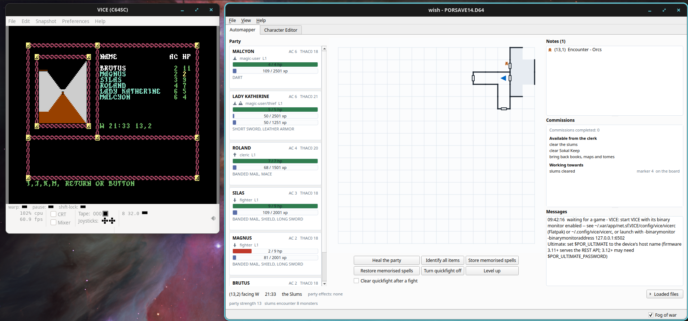
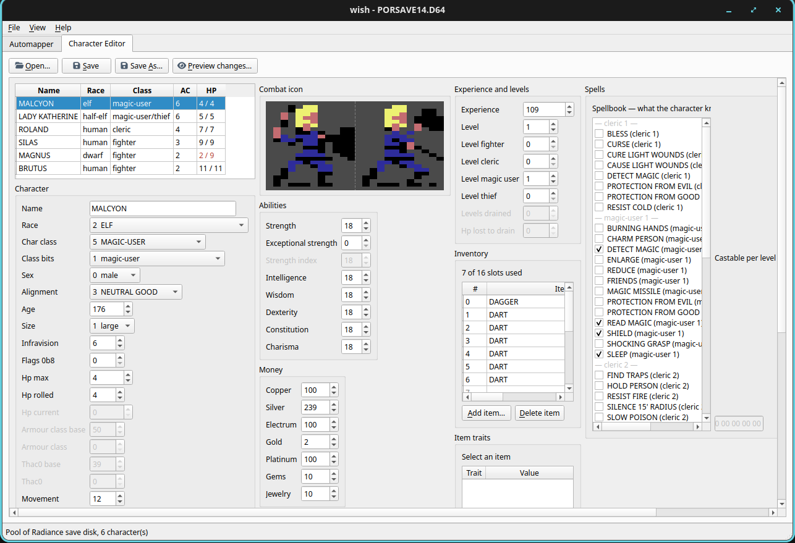
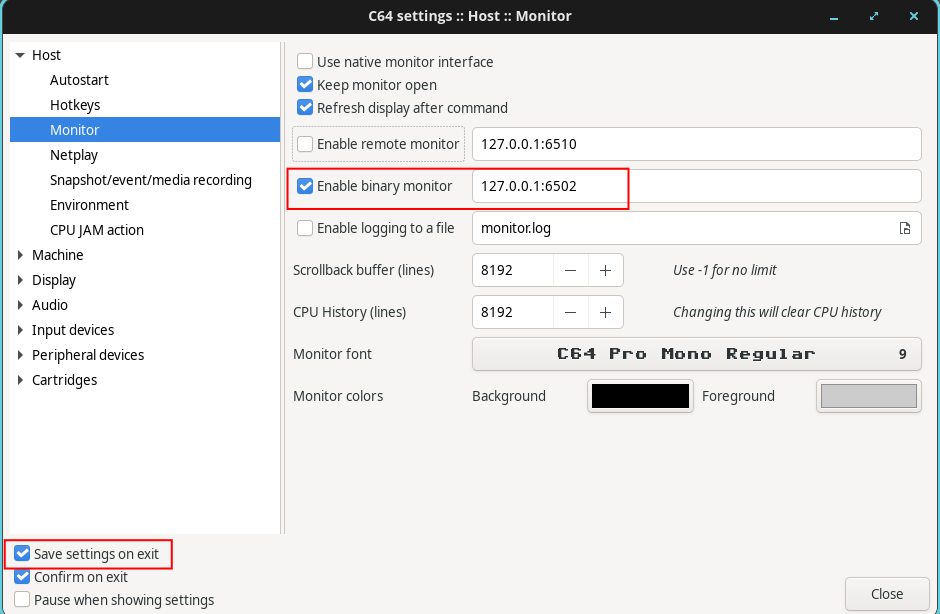

# wish

Wish is a save editor and automapper for the **Commodore 64** version of *Pool of Radiance*
(SSI, 1988). 


## AI Usage

This project is entirely generated by Claude Code.


## Requirements

* Python 3.12 or later
* A Pool of Radiance save disk (`.D64`).
* For the automapper only: the VICE emulator, and the game actually running in it.

## Installation

### Linux

Install the app via pip.

```sh
pip install wish-goldbox
```

Run the gui wit:

```sh
wish
```


## Automapper

As you play the game, the automapper will reveal the map to you, making navigation much easier.

<a href="images/automapper1.png">
  
</a>


## Character Editor


In the Character Editor tabe, you can load up a save disk and modify your party.

<a href="images/character_editor1.png">
  
</a>


### Configuring VICE

The automapper reads the running game through **VICE's binary monitor**. To turn this on:

- Navigate to Preferences->Settings
- Click Host->Monitor
- Check "Enable binary monitor".
- On the bottom left, check "Save settings on exit".

<a href="images/vice1.png">
  
</a>


On Linux, if you have VICE installed via a flatpak, you'll need to grant it extra permissions.

```sh
flatpak override --user --share=network net.sf.VICE
```


### Wish Config Files
| | Windows | macOS | Linux |
|---|---|---|---|
| settings | `%APPDATA%\wish\` | `~/Library/Application Support/wish/` | `~/.config/wish/` |
| notes, explored squares | `%LOCALAPPDATA%\wish\` | `~/Library/Application Support/wish/` | `~/.local/share/wish/` |
| save backups, when the disk's own folder is read-only | `%LOCALAPPDATA%\wish\backups\` | `~/Library/Application Support/wish/backups/` | `~/.local/share/wish/backups/` |


## Credits

Some icons are from **Font Awesome Free 7.3.1** by Fonticons, Inc.
(<https://fontawesome.com>) — icons licensed **CC BY 4.0**. Their path data is
in `ui/icons.py`; the licence is in
[`docs/licences/fontawesome-LICENSE.txt`](docs/licences/fontawesome-LICENSE.txt).
The rest of the icons — the sword, the crossed swords, the chest — are this
project's own.


## Documentation

[`docs/README.md`](docs/README.md) is the index. The knowledge base covers the
D64 container, the character record, the save game layout, and an append-only
log of every experiment — including the ones that failed.
