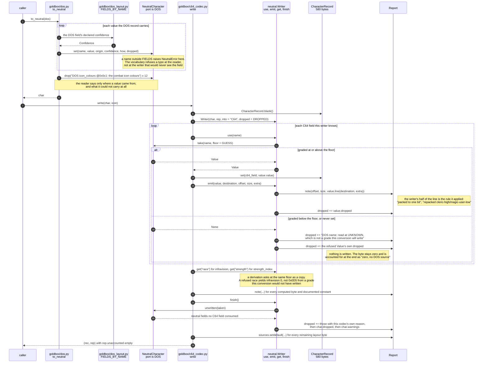
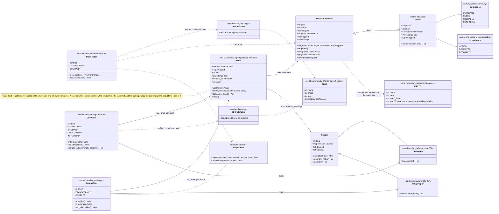
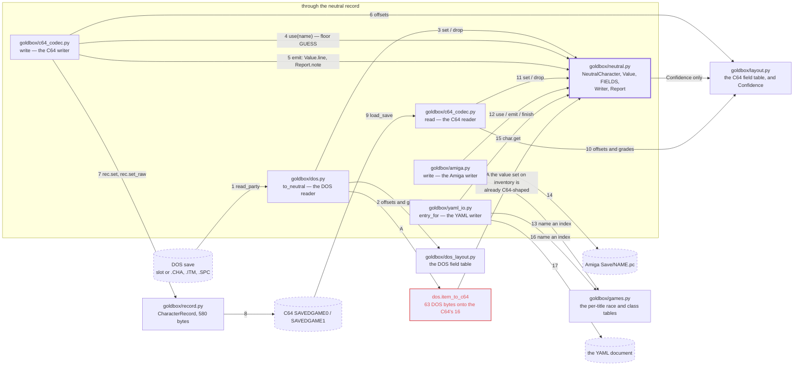
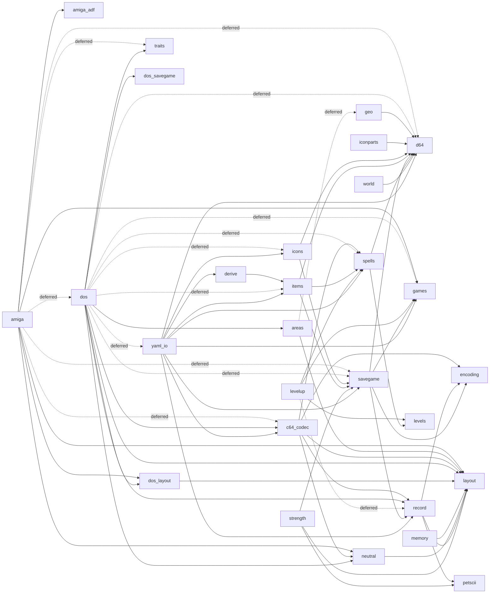

# Converting between the DOS and C64 versions — plan

**Status: the converter is written.** `goldbox/dos_layout.py` is the DOS field
table and `goldbox/dos.py` reads a DOS save, exports it as the editor's own YAML,
and builds a C64 `SAVEDGAME0`/`SAVEDGAME1` pair from it. **Steps 1 to 6 of the
order of work below are closed**, and so is step 7: `File > Import` and
`File > Export` are wired, behind `WISH_EXPERIMENTAL_DOS_IMPORT` and
`WISH_EXPERIMENTAL_EXPORT` until the conversion is proven end to end.
Everything the plan said had to be found out first has been found out —
the spell tables agree exactly, nothing DOS stores is lost that matters, and
the clock is the one loose end.

The DOS save arrived — Donald's Steam copy of
*Forgotten Realms: The Archives* carries a played DOS Pool of Radiance party in
three slots — and DOS can now be driven. **Obstacles 1, 2, 3, 4 and 7 are
closed**: the quest flags, the party's square, the current area and the whole
63-byte item record are all read, **the two ports number their areas the same
way and index their item names and item types the same way too**, and **a C64
save written from DOS fields loads and plays** — no checksum, no validation,
not a byte rewritten by the loader (obstacle 7). What is left is conversion
work, field by field, not a question about whether the game will accept it.
The plan below was written for one direction — DOS into C64 — and that
narrowing was what made it tractable. **The reverse now exists too** (#26):
`goldbox.dos.write` builds a DOS character record and its `.ITM` from the neutral
record, `goldbox.dos.new_dos_save` writes a whole C64 save into a DOS save
directory owing nothing to another save, and DOS Pool of Radiance loads and
plays the result under DOSBox — see "The reverse direction" below.

The decode: `goldbox/dos_layout.py` is the character-record field table with
confidence per field. The write-ups behind it — `work/reports/dos-saves.md`
for the character record and the saved game, `work/reports/dos-items.md` for
the items — are lost. The
measurements are asserted in `tests/test_dossave.py` and `tests/test_dosbox.py`,
which read the archives from Donald's machine and skip where there are none.
`tools/dosbox.py` is the harness that drives the game: an isolated DOSBox on
its own X display, keystrokes through `xdotool`, and the save file as ground
truth.

**Obstacle 1 is closed.** The quest-flag region is read — 179 of its 352 bytes
named from the bytecode, 135 more provably not flag storage, 38 unattributed
padding — and the DOS half turned out not to be a translation problem at all:
the ECL bytecode is one artefact shared by every port, so 178 of the 179 named
flags sit at the *same address* on DOS. See obstacle 1.

That narrowing was worth more than it looked, and it was right at the time:
**no DOS encoder** meant the DOS format only had to be decoded far enough to
source what the C64 needs. #26 reversed it deliberately — the encoder now
exists, and with it the round trip the narrowing had retired: a DOS record
read into the neutral middle and written out again is byte-for-byte the
original outside the named live-heap bytes, 24 of 24.

What it does demand is absolute: **we must be able to produce every byte of a
C64 save.** All 9216 of them. Not most, not the interesting ones — a save is a
verbatim memory image and the game reads all of it.

So the goal has a number, and the number is checkable:

| | named | of which meaning is UNKNOWN |
|---|---|---|
| `SAVEDGAME0` (7168 bytes) | **99.2%** | 38 bytes |
| `SAVEDGAME1` (2048 bytes) | **100%** | 0 |

The UNKNOWN figure was 352 until the quest-flag pass; what is left of it is
38 scattered bytes inside `$4A20`-`$4AF8` that no script names and that are
zero in every save we hold.

Being able to *name* a region is not the same as being able to *fill* it, which
is what the obstacle list below is about. But it says where the edges are, and
`goldbox/memory.py` already generates it — so progress is measurable rather than
felt.

Donald asked whether the editor could turn a DOSBox save into a C64 save.
The answer is **yes, and the code to do it is written**: `goldbox.dos.convert_save`
takes a DOS save directory, a slot letter and an existing C64 save's two
payloads and rewrites them. What is left is the menu item.

---

## What the two formats actually are

The record is **rearranged, not translated**. Both ports store the same
information; neither stores it in the same place. The DOS record is **285
bytes**; the C64's is 580, of which 256 is the inventory and 36 the combat
icon — so the parts that correspond are almost the same size.

Every row below was checked against 24 real DOS specimens. Nothing in the
predicted table had to be corrected.

| field | DOS | C64 | |
|---|---|---|---|
| name | `0x000` length byte, then 15 | `0x000`, 20 bytes, NUL-padded | CONFIRMED |
| strength | `0x010` | `0x014` | CONFIRMED |
| intelligence | `0x011` | `0x015` | CONFIRMED |
| exceptional strength | `0x016` | `0x01A` | CONFIRMED |
| THAC0 base, `60 − value` | `0x02D` | `0x071` | CONFIRMED |
| race / class | `0x02E` / `0x02F` | `0x072` / `0x073` | CONFIRMED |
| age | `0x030`, 2 bytes | `0x074`, 2 bytes | CONFIRMED / the high byte is 0 in all 24 |
| hit points maximum | `0x032`, **1 byte** | `0x076`, **2 bytes** | CONFIRMED — `0x033` starts the spellbook, so there is no room for a second |
| saving throws | `0x06D`, 5 | `0x09A`, 5 | CONFIRMED |
| level | `0x073` | `0x0A0` | CONFIRMED |
| thief skills | `0x077`, 8 | `0x0A5`, 8 | PROBABLE |
| money — cp sp ep gp pp gems jewelry | `0x088`, 7 × `u16le` | `0x0BB`, 7 × `u16le` | CONFIRMED |
| per-class levels, 8 wide | `0x096` | `0x0C9` | CONFIRMED, **but differently ordered** — see below |
| sex | `0x09E` | `0x0D6` | PROBABLE |
| experience | `0x0AC`, `u24le` | `0x0E8`, `u24le` | CONFIRMED |
| class bitmask — 1 mage, 2 cleric, 4 thief, 8 fighter | `0x0B0` | `0x0EB` | CONFIRMED, same bit order |
| party order | `0x0BF` | `0x10D` | CONFIRMED |
| item count | `0x0C7` | — | CONFIRMED; the C64 carries the items in the record instead |
| encumbrance | `0x102`, `u16le` | — | CONFIRMED; the C64 has no such field |
| hit points current | `0x11B` | `0x119`, 2 bytes | CONFIRMED |
| alignment | `0x0A0` | `0x0D8` | PROBABLE — the C64's nine-entry table, fixed by the runs either side |
| the whole combat tail | `0x110`-`0x11C` | `0x10E`-`0x11B` | PROBABLE — THAC0, armour class, the armour bonus and the eight running attack-form bytes, **one for one at −2**, hit points widening by a byte at the end |

The early fields differ by **exactly four**, which is exactly how much wider the
C64's name field is — the abilities are otherwise in the same order. Past that
the layouts diverge properly; from THAC0 base onwards the gap is `0x44`.

**Three places where they diverge in kind, not merely in offset.** These are
the real conversion work.

* **The spellbook.** The C64 packs it into 7 bytes of bits at `0x078`. DOS
  spends **one byte per spell** across `0x033`–`0x06A`, in an order grouped
  cleric-1, mage-1, cleric-2, mage-2, cleric-3, mage-3. **The ordering has
  been checked and it is the identity**: DOS byte *n* is spell id *n* + 1, the
  same id `goldbox/spells.py` uses, so the conversion is a pack and not a
  permutation. See "What had to be found out first" below.
* **The per-class level array.** Eight wide on both. The C64's slots are
  ordered by the class *bits* (magic-user, cleric, thief, fighter, knight, —,
  paladin, ranger); DOS's are indexed by the class *number* (cleric, druid,
  fighter, paladin, ranger, mage, thief, monk). Same width, different meaning
  per slot.
* **Items.** Less than it looked. See obstacle 3: past its cached display
  line the DOS record *is* the C64's 16 bytes, unpacked one field to a byte.

Two things that are *not* obstacles: **both machines are little-endian** —
now verified on the file rather than assumed, see below — and the DOS
character file is ASCII, so names need padding and length-prefixing rather than
transliteration. There is no PETSCII in the record.

**Byte order, checked rather than inherited.** The Amiga stores the DOS field
order big-endian, so the claim needed testing. Three readings agree it is
little-endian on DOS: experience read big-endian puts a level-3 fighter past
ten million; both elves come out aged 46080; and the encumbrance identity
below — arithmetic entirely inside the file — only balances one way round.

**The identity worth knowing**, because it checks four things at once:

```
encumbrance (0x102) = cp + sp + ep + gp + pp + gems + jewelry
                        + Σ (item weight × quantity)
```

It balances exactly for 16 of the 18 saved characters and for all six exports.
That single sum confirms the money block, the 63-byte item stride, the weight
offset and the byte order together.

The DOS layout was originally taken from the community format notes in
`work/coab-research/formats/`. **They were right about every field they
predicted.** That is a fact about those notes worth carrying to the next
title.

---

## The one converter that already exists: the game's own

Curse of the Azure Bonds imports a Pool of Radiance character, and
**`simeonpilgrim/coab` carries that routine as source**, recovered from the
shipped DOS overlays. It is the best outside evidence this project has for the
conversion, because it is not somebody's reading of a file format — it is the
arithmetic the engine runs.

The files, read from `work/forums/ext/` (fetched, `.gitignore`d, not committed):

| file | what it is |
|---|---|
| `Classes/PoolRadPlayer.cs` | the DOS **Pool of Radiance** record, `StructSize = 0x11D` (285), fields named where Simeon identified them |
| `Classes/Player.cs` | the DOS **Curse** record, `StructSize = 0x1A6` (422), with **81 machine-readable `[DataOffset]` attributes** |
| `engine/ovr017.cs` | `ConvertPoolRadPlayer` (`import_char01`'s Pool branch) — the import itself |
| `engine/ovr025.cs`, `ovr026.cs` | `reclac_player_values` (`sub_66C20`) and `ReclacClassBonuses` (`sub_6A3C6`), which run over the result |

*Confidence: PROBABLE throughout this section.* Nothing here has been checked
against a DOS file on this machine; it is read off someone else's decompilation.
But it derives from the shipped overlays and it agrees with our own offsets
wherever both name the same field.

### What the import does, field by field

`ConvertPoolRadPlayer` starts from a **zeroed** `Player`, so every field it does
not write is left at zero — and **106 of the 285 DOS Pool bytes are never even
read**, in seven runs: `0x17`–`0x2C` (22), `0x7F`–`0x82` (4), `0x88`–`0x95`
(**the seven money words**, 14), `0xBF` (party order), `0xC8`–`0xFF` (56,
containing the item pointer block at `0xCC`), `0x104`–`0x10B` (8) and `0x10F`.
What the routine
declines to carry is as informative as what it copies.

| what happens | source | lands on |
|---|---|---|
| **name** copied | Pool `0x00` | Curse `0x00` |
| **six abilities and exceptional strength**, each `Load`ed then `EnforceRaceSexLimits(race, sex)` | Pool `0x10`–`0x16` | Curse `0x10`–`0x1D` — and `Load` writes **both halves of the (base, current) pair**, which is why one Pool byte fills two Curse bytes |
| **THAC0, race, class, age, hit points maximum** copied | Pool `0x2D`, `0x2E`, `0x2F`, `0x30`, `0x32` | Curse `0x73`, `0x74`, `0x75`, `0x76`, `0x78` |
| **spellbook**: 56 bytes copied into a 100-byte array, then `spellBook[animate_dead − 1] = 0` | Pool `0x33`–`0x6A` | Curse `0x79`; spells 57–100 stay zero. `coab`'s enum gives `animate_dead = 0x24` — **spell id 36, exactly `docs/86`'s** |
| **attack level, `field_6C`, five saving throws, base movement, hit dice, levels lost, hit points lost, `field_76`, eight thief skills** copied | Pool `0x6B`–`0x7E` | Curse `0xDD`–`0xF1`. `multiclassLevel` (Curse `0xE6`) is set from hit dice, not from the source |
| `field_83`–`field_87` copied | Pool `0x83`–`0x87` | Curse `0xF6`–`0xFA` |
| **money: `Money.SetCoins(Money.Platinum, 300)`** | *nothing* | Curse `0xFB`. Pool's own money block at `0x88`–`0x95` is **not read by the loader at all** — `PoolRadPlayer` has no field there |
| **per-class levels, sex, monster type, alignment, the eight attack-form bytes, base armour class, experience, class flags, hit points rolled, spells-cast counts, the icon bytes and six icon colours** copied | Pool `0x96`–`0xC6` | Curse `0x109`–`0x14A` |
| **items** come from the separate `<name>.swg` file, not the record. The item *count* at Pool `0xC7` is commented out in the reimplementation; the assembly quoted beside it copies **0x34 = 52 bytes** of item pointers from Pool `0xCC` to Curse `0x151` | | |
| **the combat-state tail** — hands used, weight, health status, in-combat, team, hit bonus, armour class, attacks left, dice, damage bonuses, current hit points, movement | Pool `0x100`–`0x11C` | Curse `0x185`–`0x1A5` |
| **active effects are filtered.** From the Pool `.spc` file only seven effect ids survive: `18, 26, 47, 48, 97, 107, 124` | | `coab`'s `Affects` enum names them **gnome vs man-sized giant, dwarf vs orc, dwarf and gnome vs giants, `affect_30`, constitution saving bonus, elf sleep resistance, half-elf resistance** — every one an **innate racial or constitutional bonus**. Every temporary spell effect is dropped |

Then `reclac_player_values` and `ReclacClassBonuses` run over the result and
**recompute** armour class from base plus dexterity plus readied items; hit
bonus; movement; encumbrance; attacks per round; base THAC0, from a class × level
table, taking the maximum over the eight class slots; hit dice; the class-flags
bitmask, from the class-level array; the five saving throws; the thief skills,
**but only when thief level > 0**; and `attackLevel`, which is set to the fighter
class level or to 1 when there is none. A **cleric's entire spellbook is
regenerated** by level from the spell-casting table — and that loop excludes
`animate_dead` too, so the spell is erased twice over.

Two side observations worth keeping. `reclac_player_values` computes
encumbrance as `Σ (item weight × count) + Σ all seven money counts`, which is
**the identity above, confirmed from code** — and it means the field is derived,
not stored, so a converter never has to source it. And `docs/116`'s open
question about where Curse keeps its dual-class array has a lead: DOS Curse
`0xE6` is `multiclassLevel`, and it has no C64 counterpart under the alignment
below.

### Against our own measurement: 12 of the fifteen bytes

`docs/116` imported three Pool of Radiance characters into C64 Curse, exported
one again, and found **15 of 580 bytes changed**. The DOS routine accounts for
twelve of them.

| our change (`docs/116`) | the DOS routine | |
|---|---|---|
| `0x065`–`0x06B`, the second ability array, written from `0x014`–`0x01A` (7 bytes) | `stats2.X.Load(pool.stat_X)` — Curse stores every ability as a (base, current) pair and `Load` writes both halves from Pool's single byte | **explained** |
| `0x0C1` gold zeroed (1 byte) and `0x0C3` platinum set to 300 (2 bytes) | Pool's money is never read; a fresh `MoneySet` is all zero and `SetCoins(Platinum, 300)` is the only write | **explained, and sharper than we measured** — see the prediction below |
| `0x098` fighting level set (1 byte) | `reclac_player_values`: `attackLevel = SkillLevel(Fighter)`, else 1 | **explained** |
| `0x10F` roster armour class recomputed (1 byte) | `reclac_player_values`: `ac = base_ac`, then dexterity and readied-item bonuses | **explained** |
| `0x073` `char_class` zeroed (1 byte) | the DOS routine *copies* the class byte straight across | **not explained** |
| `0x0FE`, `0x0FF` portrait head and body zeroed (2 bytes) | the DOS routine copies `head_icon` and `weapon_icon` straight across | **not explained** — but they are probably not the same field. The C64's 36-byte combat icon at `0x220` passes through untouched, so `0x0FE`/`0x0FF` are the C64's own indices into `CHARPIC00`, which Curse does not share |

`docs/116` also saw saving throws change where an item bonus had been baked in,
and **thief skills re-derived rather than copied**. Both are `ReclacClassBonuses`
exactly: `reclac_saving_throws` unconditionally, `reclac_thief_skills` only for a
thief. And what passed through byte for byte — experience, level, the per-class
level array, class bits, hit points, the spellbook, race, age, alignment, sex —
is what the routine copies verbatim, or recomputes to the same value it started
from.

**Four predictions the C64 experiment can now test**, none of which the party
used could have shown:

1. **All seven money words are discarded**, not just gold. We saw gold zeroed
   because the character carried gold; import one carrying copper, gems and
   jewelry and every word should come out zero except platinum = 300.
2. **ANIMATE DEAD is erased.** Spell id 36, which is bit 4 of `0x07C` in the
   C64's spellbook bitmask at `0x078` — the mask indexes by spell id, not by
   id − 1. No character imported so far knew the spell.
3. **A cleric's spellbook is regenerated from his level**, not copied — which is
   invisible for a Pool cleric, who already knows every spell he can cast, but
   would show on a cleric whose book had been edited.
4. **Only innate racial effects survive.** Import a character under a lasting
   spell effect and it should be gone.

### Where the C64 record sits against DOS Curse

The 81 `[DataOffset]` attributes make the DOS Curse record machine-readable, and
laid against `goldbox/layout.py` the two run **the same fields in the same order**
at three displacements:

| zone | DOS Curse → C64 | why it shifts |
|---|---|---|
| name and abilities | +4 on the early fields | the C64 name field is 20 bytes to DOS's 16 |
| THAC0 `0x73` → `0x071`, race `0x74` → `0x072`, class `0x75` → `0x073`, age `0x76` → `0x074`, hit points `0x78` → `0x076` | **−0x02** | |
| attack level `0xDD` → `0x098`, saving throws `0xDF` → `0x09A`, movement `0xE4` → `0x09F`, thief skills `0xEA` → `0x0A5` | **−0x45** | **the spellbook**: DOS spends one byte per spell (56 in Pool, 100 in Curse), the C64 one *bit* — 7 bytes at `0x078` |
| money `0xFB` → `0x0BB`, per-class levels `0x109` → `0x0C9`, class flags `0x12B` → `0x0EB` | **−0x40** | the C64 gains five bytes: DOS spends 9 bytes on a 4-byte far pointer to the affect list plus five flag bytes (`0xF2`–`0xFA`), the C64 spends 14 (`0x0AD`–`0x0BA`) holding the item effects **inline** |

**The one field that is not a re-offset of the same data is the spellbook.** Any
DOS→C64 converter has to expand or pack that field and can copy almost
everything else.

One place the alignment is ambiguous by a byte, and it is worth saying so rather
than papering over it: `0x0A0`–`0x0A5`. DOS Curse runs hit dice, multiclass
level, levels lost, hit points lost, `field_E9`, thief skills; the C64 runs
level, levels drained, hit points lost to drain, turn class, turn power, thief
skills. DOS Pool has no `multiclassLevel` — the importer sets it from hit dice —
and `docs/117`'s own DOS Pool table has level at `0x073` → `0x0A0` (CONFIRMED)
and thief skills at `0x077` → `0x0A5` (PROBABLE), a one-byte gain in between.
The reading that fits everything is that **`multiclassLevel` is Curse-only and
the C64's `turn_class` at `0x0A3` has no DOS counterpart**, the two cancelling so
that −0x45 resumes at `0xE9` → `0x0A4`. PROBABLE, and one Curse specimen with a
turn-undead class settles it.

---

## What a DOS save actually is, as files

No container and no checksum: DOS writes plain files into its save directory.
Steam redirects that directory to `SavesDir/<steamid>/<appid>/English/`.

| file | what it is |
|---|---|
| `CHRDAT<slot><1..6>.SAV` | one character of the saved party. **285 bytes** |
| `<NAME>.CHA` | one *exported* character. **The same 285 bytes, same layout** — the export is the slot copied out, not a reduced form. The only systematic difference is that the item count at `0x0C7` is zeroed |
| `<stem>.ITM` | that character's items, **63 bytes each**, no header. **The suffix is per title and so is the stride** (#113): Curse writes `.SWG` and Silver Blades `.STF` at **67** bytes, measured on a played game — 804 bytes for 12 items, which 63 does not divide. Until that was found, `read_character` returned an item *count* with an **empty item list** and no error for both titles |
| `<stem>.SPC` | that character's active effects, **9 bytes each**; absent when there are none. One effect id, four payload bytes and a four-byte far pointer to the next record, which the loader rebuilds -- see "The `.SPC` effects file" |
| `CHARLIST.TXT` | the names the "add character" menu offers. Plain text, CRLF |
| `SAVGAM<slot>.DAT` | the saved game. **13137 bytes** — one header byte, then the engine's variable space as `u16le`; see obstacle 1. The header byte is the `GEO`/`ECL` `.DAX` file number of the current area, 1–8; see obstacle 2 |

Slots are letters, not numbers; the engine's own format strings (visible in
Gold Box Companion's `Game.dat`) are `CHRDAT%s%d.SAV` and `SAVGAM%s.DAT`.

## Characters first, because they are the tractable half

The **character file** is what the games themselves move: Pool of Radiance
exports characters and Curse of the Azure Bonds imports a party. Getting that
working is step one and is worth having on its own — and because a DOS export
and a DOS save slot are byte-for-byte the same structure, one reader serves
both.

But the goal is the whole save, so the rest of this plan is about what stands
in the way.

## One warning for anything past Pool of Radiance

**The DOS record grows with every title: 285, 422, 439, 510 bytes for Pool of
Radiance, Curse, Secret of the Silver Blades and Pools of Darkness.** The C64
record does not — Curse reuses Pool of Radiance's 580 bytes at the same
offsets, which is this project's most valuable transferable fact.

*That fact is a C64 fact.* From Curse onwards the DOS record stores every
ability **twice**, as (base, current) pairs at `0x010`–`0x01D`, and everything
after shifts by `0x46`. A DOS reader is per title. What does hold across the
family is the item stride (63) and the effect stride (9), Pool of Radiance
through Pools of Darkness and across into the Savage Frontier pair.

### All four titles read, one row each (#53)

The four records are **the same field sequence at four widths**. Nothing is
reordered and nothing is inserted out of turn; what changes is how wide a
field is, whether it is there at all, and how much undecoded space sits
between two named ones. So `goldbox/dos_layout.py` carries one `DosShape` per
title — a set of width overrides against Pool of Radiance's table — and
`layout_for` accumulates the offsets. **A width that is wrong stops the record
adding up to its own size**, and that raises at import rather than reading
rubbish.

| | Pool of Radiance | Curse | Silver Blades | Pools of Darkness |
|---|---|---|---|---|
| record | 285 | 422 | 439 | 510 |
| item / effect file | `.ITM` / `.SPC` | **`.SWG`** / `.FX` | **`.STF`** / `.SFX` | `.THG` / `.EFX` |
| bytes per item | 63 | 63 | **67** | 63 |
| bytes per ability | 1 | 2 | 2 | 2 |
| memorised-spell region | 21 | 84 | 75 | 141 |
| spellbook entries | 56 | 100 | 117 | 125 |
| spell-slot arrays × levels | 2 × 3 | 3 × 5 | 4 × 7 | 3 × 9 |
| per-class level arrays | 1 × 8 | 2 × 8 | 2 × 7 | 3 × 7 |
| coin slots | 7 | 7 | 7 | **3** |
| saved game | `SAVGAM?.DAT` 13137 | `SAVGAM?.DAT` 13149 | `SAVGAM?.DAT` 5469 | `SAVGAM?.PTY` 1364 + `VAULT?.DAT` 12 |

The spellbook widths are not guesses: 100 and 117 are `goldbox/spells.py`'s own
Curse and Silver Blades id spaces, measured on the **C64** long before any DOS
record was read, and they land exactly.

**The evidence, and it is content rather than arithmetic.** 54 shipped records
across the four titles, and every one of them:

* rebuilds byte for byte through `_decode`/`_encode` — 54 of 54;
* balances `money + Σ(weight × quantity)` against its stored encumbrance —
  54 of 54, which is what says Pools of Darkness really does keep three coin
  slots where the others keep seven;
* sets exactly the per-class level slots its class byte names, indexed by
  class *number* — 54 of 54;
* agrees with its own `class_bits`, computed from the level arrays — 54 of 54.

And the sharpest of them, because neither side knew about the other: DOS
Silver Blades' three shipped rangers hold **exactly** the level-8 row of the
ranger grant table `tests/test_silverblades.py` reads mechanically out of the
**C64** `GEN` file — 77, 78, 79, 80 and nothing else, 3 of 3, at a 117-byte
spellbook `0x071` bytes into a 439-byte record. Its two clerics hold the
cleric grant's levels 1–4 the same way.

### The container, per title

`goldbox/dos_savegame.py`'s `SAVE_SHAPES` is the record table's sibling and
works the same way: a title is a row of region widths, and the widths have to
add up to the size the file is or the row raises at import.
[`141-dos-savegame.md`](141-dos-savegame.md) has the region map and the
evidence; the short version is that **all four containers end the same way and
differ only in front of that**.

| | Pool of Radiance | Curse | Silver Blades | Pools of Darkness |
|---|---|---|---|---|
| file | `SAVGAM?.DAT` 13137 | `SAVGAM?.DAT` 13149 | `SAVGAM?.DAT` 5469 | `SAVGAM?.PTY` 1364 + `VAULT?.DAT` 12 |
| undecoded head | — | — | — | **1024** |
| container-number byte | 1 | 1 | 1 | — |
| ECL variables, `u16le` from `$4900` | 2560 | 2560 | 2560 | — |
| staged `ECL<n>.DAX` script | 7680 | 7680 | — | — |
| unnamed, before the square | — | 12 | 12 | 4 |
| square block, ending in the party size | 8 | 8 | 8 | 8 |
| six 41-byte `CHRDAT` entries | 246 | 246 | 246 | 246 |
| UI scratch | 82 | 82 | 82 | 82 |

**Silver Blades stages no script, and that is the whole of why its save is
less than half the size.** Its own scripts are no smaller — its largest
`ECL<n>.DAX` block is 7678 bytes against Pool of Radiance's 7679 — so the
engine reloads them from the container instead of carrying them in the save.
That matters to a conversion: writing the target area's script into the
buffer is the one write in the recipe for moving a Pool of Radiance save to
another area that needs the player's own game files, and Silver Blades and
Pools of Darkness would not need it at all.

**Curse and Silver Blades share Pool of Radiance's variable array**, at the
same file offset and the same ECL addresses — CONFIRMED on the four
containers by two readings 1602 words apart: `$5012` equals the header byte
(2 and 2 in Curse, 1 and 1 in Silver Blades) and `$503E` equals the party-size
byte (6 in both). `$49E6`, the indoors flag, reads 1 in all four.

**Pools of Darkness' first 1024 bytes are undecoded.** No header byte, and
neither `$5012` nor `$503E` is at any offset under Pool of Radiance's origin.
Five nonzero bytes in the whole region, because the shipped container is a
party that has never been played.

**The size names the shape, not the game.** Treasures of the Savage Frontier
writes the same 1364-byte `SAVGAM<slot>.PTY` and 12-byte `VAULT<slot>.DAT`
that Pools of Darkness does, with the same 336-byte tail; only the directory
says which game a file came from.

### What the other three titles cost to *convert*, which is not the same thing

Reading is per title and now works for all four. **Converting is Pool of
Radiance's alone** and `dos.to_neutral` raises `WrongTitleError` for the rest,
because no other pair of ports has been measured against each other. Pools of
Darkness never shipped on the C64 at all, so its only counterpart is the Amiga
(`docs/124-amiga-port.md`).

---

## The shape of it

One neutral record in the middle and a codec per format around it. A **reader**
decodes one port's bytes into named neutral values; a **writer** encodes those
values into another port's bytes; neither knows the other exists.

```
DOS character file  ->  reader  ->  NeutralCharacter  ->  writer  ->  C64 record
```

The middle is `goldbox/neutral.py`: a typed record of 64 declared fields, each one
a `Value` carrying the number, the grade the source's own field table gave it,
and the phrase saying where it came from. It also holds `Writer`, the
take-refuse-report protocol every writer inherits rather than copies. Every
port keeps its own declarative table with a confidence on every field —
`goldbox/layout.py` for the C64, `goldbox/dos_layout.py` for DOS — and a codec reads
only its own.

The YAML export is not the interchange. It was, while there was one direction;
it is one more codec now, and `goldbox/yaml_io.entry_for` takes a
`NeutralCharacter` like every other writer.

---

## What cannot survive the trip

* **The combat icon.** C64 icons are 18 screen codes into `CHARPIC00` plus 18
  colours — a C64 charset. DOS has no such thing, so the icon must be built
  from the option tables (`goldbox/iconparts.py` composes a legal one).
* **Portrait ids.** `HEADnn`/`BODYnn` name files on the C64 disks. The DOS art
  is a different set with different numbering.
* ~~**Anything cached rather than stored.**~~ This said the C64 roster's
  derived combat values should be recomputed rather than copied. They should
  be **copied**: DOS `0x110`-`0x11C` is the C64 roster block `0x10E`-`0x11B`
  at a displacement of −2, field for field. Leaving them zero is not neutral
  — a converted party whose roster armour class is zero displays **AC 60** on
  the character list, which is what the first end-to-end run showed.
* **The item list's heap pointers.** DOS chains its items through a far
  pointer at `0x02A`; the C64 keeps 16 fixed slots. Drop the chain, keep the
  order. (Item *numbering* is not on this list after all: the DOS name words
  and type byte are already the C64's indices.)
* **One spell.** The numbering was checked and agrees exactly, so the
  spellbook is not on this list — except for id 56, `RESTORATION`, which DOS
  has a byte for and the C64's 56-bit mask has no room for. Zero in every
  specimen; reported, not dropped.
* **Encumbrance and per-item weight**, which DOS keeps and the C64 does not.
  Both are derived; drop them.

## Losslessness, which is the project's whole promise

`wish` never modifies a save it was given, and a no-op save is byte-identical.
Conversion is a different act — it *creates* a save — so the promise takes a
different form:

* the DOS save is **read only**, always; the C64 save is a new file;
* **every byte written must be justified.** Either it came from the DOS save,
  or it was computed, or it is a documented constant. "Copied from a template
  and probably fine" is a category that should not exist by the end.
* every DOS field with no C64 home is **accounted for**, not silently dropped.
  `goldbox/dos.py`'s `field_disposition()` is where that promise is kept and
  `test_every_declared_field_has_a_disposition` is what enforces it: a field
  the layout declares and the three tables never name fails the build.
  **What the player is shown is a shorter list than that**, since 2026-08-27
  — a value the C64 derives for itself, a spell effect that was about to
  expire, and three offsets saying the DOS combat figure does not convert are
  all lines nobody using the program can act on. `UNREPORTED_DROPS`,
  `ICON_DROPS` and `COMBAT_ICON_DROP` name exactly which, and the three icon
  fields become one sentence rather than disappearing. Keeping a line out of
  the pane does not take it out of the account;
* the finished converter should be able to say, for any offset in its output,
  *where that byte came from*. That is the test, and it is stricter than a
  round trip would have been.

---

## Everything a C64 save contains, and whether we can produce it

`SAVEDGAME0` is a verbatim image of `$4900`-`$64FF` (7168 bytes) and
`SAVEDGAME1` of `$8300`-`$8AFF` (2048). To write one, **every byte has to come
from somewhere.** This is the whole list.

| region | size | what it is | can we produce it from a DOS save? |
|---|---|---|---|
| `$4D00`-`$58FF` | 3072 | twelve character slots | **yes, with work** — a field remap, `goldbox/dos_layout.py` |
| `$5900`-`$64FF` | 3072 | item area, 16 items x 16 bytes per slot | **yes** — the DOS item record's last 17 bytes *are* the C64's 16, unpacked; `tools.dosbox.item_to_c64` is the copy. Obstacle 3 |
| `$8300`-`$83FF` | 256 | roster: derived combat values | **yes** — recompute for the target, do not copy |
| `$8400`-`$8753` | 852 | `ANIMATE00`, resident — code, not party state | **yes** — read the file off the player's own `POOL` disk. 852 payload bytes at load address `$1000`, byte-identical on all eight sides, and 829 of the 852 match what an engine-written save holds here on all 14 of Donald's save disks. `$8400 + 852 - 1` is `$8753`, so the boundary with the buffer below is the file's own length rather than a guess. **Not scratch**: cache slot 11 tells the engine the file is resident, so nothing reloads it — `docs/140-loaded-files-cache.md` §"Slot 11 is not lazy, because the save is carrying the file", and #122 |
| `$8754`-`$8AFF` | 940 | bitmap buffer | **yes, as zero** — 407 non-zero bytes of a template wiped, and the result loaded, walked, fought and changed area indistinguishably from the control (#118 step 3) |
| `$4BE0`-`$4CFF` | 288 | combat icon table | **synthesise** — DOS has no equivalent; `goldbox/iconparts.py` composes the icon the game's own character creation writes. **Zero is refused**: screen code 0 in `CHARPIC00` is a real glyph, so a zeroed icon draws as a 3x3 block of black hooks in a fight (#57) |
| `$49C0`-`$49C2` | 3 | party x, y, facing | **yes** — DOS keeps them at file offsets 12801, 12802, 12803; the facing is the C64's doubled. Obstacle 2 |
| `$4BC2` | 1 | current `GEO` | **yes** — DOS keeps the area id at file offset 395, in the same numbering. Obstacle 2 |
| `$49C6`-`$49CB` | 6 | clock, six digits | **probably** — needs the DOS clock format |
| `$4BC0`-`$4BD8` | 25 | loaded-files cache | **yes** — `$FF` in all twenty-five slots, then slot 2 = the area's `GEO` number and slot 8 = the area id; see "The loaded-files cache, and the three bytes with it" below |
| `$4900`-`$49BF`, `$4B80`-`$4BBF` | 256 | four effect arrays | **yes, by dropping them** — zero means no active effects, which is a legal state |
| `$4A00`-`$4A1F` | 32 | per-script scratch | **yes** — `DUNGEON $202A` zeroes it on every area change anyway |
| `$4A20`-`$4AF8` | 217 | **persistent quest flags** | **yes.** Located: `SAVGAM?.DAT` offsets 577-1009, one `u16le` per C64 byte. See obstacle 1 |
| `$4AF9`-`$4B7F` | 135 | **not flag storage at all** — no ECL operand and no engine reference names anything in it | **yes** — zero, in all 21 specimens and by construction |
| the gaps | ~50 | `$49C3`/`$49C4`, `$49CC`-`$49E5`, `$49EB`-`$49EF`, `$49F3`-`$49FB`, `$49FF`, `$4BD9`-`$4BDF` | **unknown, mostly zero.** `$49C3`/`$49C4` are the wilderness travel position; the rest is unattributed. Four bytes have left this row: `$49EA` is the disk hint, `$49E6` is indoors-or-travel-grid, `$49C5` is the resident `GEO` and `$49F2` the script id, and the converter writes all four — `docs/140-loaded-files-cache.md` |

## The obstacles, worst first

This list was written when nothing below required writing a DOS file; the
reverse direction has since been built and has its own section further down.

**1. The quest flags — the correspondence is identity.**
`$4A20`-`$4B7F` is 352 bytes. Every one of them has a disposition:
**179 named** from an ECL instruction that
writes them, **135** (`$4AF9`-`$4B7F`) shown not to be flag storage at all, and
**38** unreferenced padding between the per-area blocks. The region is one
private block per area script plus the City Hall's books. The write-up
that established this, `work/reports/quest-flags.md`, is lost.

**And the other ports use the same addresses.** Two independent lines:

* **Amiga Pool of Radiance.** `ecl.dax` on disk 2 of the rips in
  `/mnt/media/roms/amiga/` unpacks to the C64's own scripts — 29 of the C64's
  30, each carrying the C64 `ECL` load address `$1388`, seven of them
  byte-identical. Walking them for `$4A20`-`$4B7F` references gives 1409 hits
  across **171 addresses, against the C64's 172**, with no Amiga-only address.
  The 26-entry ledger at `$4AA6`, the ten `ADD 1` sites on `$4AC1` and the
  eight-entry lock table at `$4AEA` are all present unchanged. One flag,
  `$4AD1` in the lizardman keep, is gone on the Amiga along with the encounter
  that set it. (The Amiga is a proxy for the *scripts* only. Its character
  record follows the DOS field order but stores multi-byte fields big-endian —
  don't read the DOS layout off it.)
* **DOS, through Curse of the Azure Bonds**, where we hold both ports.
  Decoding DOS `coab/Data/ECL*.DAX` and diffing against C64 `CURSE*.D64`
  `ECL*`: of the 24 scripts in both, **18 differ only in the 2-byte load
  address** (`$1388` DOS, `$3000` C64), two are byte-identical, four differ in
  length because the C64 split them. The payload — absolute address operands
  included — is the same bytes.

So the DOS flag addresses are `$4A20`-`$4AF8`, meaning what the report says.
CONFIRMED for the Amiga, PROBABLE for DOS, the gap being that no DOS *Pool of
Radiance* `ECL` file has been read, only DOS *Curse*.

*What is left* is not the meaning but the **offset**: the C64 save is a memory
image based at `$4900`, so the block is `SAVEDGAME0` offset `0x122`.

**Where the same 217 bytes sit in a DOS save is now answered, and the answer is
better than a bare offset.** `SAVGAM<slot>.DAT` is one header byte followed by
a 16-bit little-endian array of the engine's whole variable space, indexed by
the address the ECL bytecode itself uses:

```
file offset of ECL address A  =  1 + 2 × (A − $4900)
```

2560 entries cover `$4900`-`$52FF`; the remaining 8016 bytes are mapped in
[`141-dos-savegame.md`](141-dos-savegame.md) (#59): 7680 of them are the
current area's ECL script, byte-identical to its `ECL<n>.DAX` block from byte
2 on, and the rest is the square, the party size, the `CHRDAT` filename table
the engine loads the party from, and UI scratch. **The script buffer is live
on load** — this said it was "reloaded from the DAX on load, dead data for a
converter", and #60 refuted it: a save carrying the wrong area's script dies
in `Load3DMap` however many variables it writes, so writing the target's own
script is one of the retarget's writes. The mechanism is in the Curse reimplementation:
`vm_SetMemoryValue` in `work/coab/engine/ovr008.cs` ends in
`area_ptr.field_6A00_Set(0x6A00 + (location * 2), value)` — the operand
address doubled — and `ovr021.cs` annotates the same array `// as WORD[]`.

Read that way, three saves of two different parties agree line for line: the six Sokal Keep flags
(`$4A21`, `$4A26`-`$4A29`, `$4AD7`) are 255 in the save whose party has taken
the keep and 0 in the two that have not (asserted in
`tests/test_dosconvert.py::test_the_sokal_keep_flags_are_set_together_or_not_at_all`);
the seven consecutive slum flags
`$4ACA`-`$4AD0` are set together or not at all
(`tests/test_dossave.py::test_the_slums_flags_are_set_together`); `$4ABB` counts slum encounters
cleared; and `$4AC1`, the commissions counter with ten `ADD 1` sites, reads
0, 1 and 2 across the three saves in the order the parties progressed. Every
nonzero word in the 217-entry window is 1, 2, 3 or 255 and none exceeds 255 —
the C64's bytes, widened. A base off by one would straddle the runs.
**CONFIRMED**, and asserted in `tests/test_dossave.py`.

So the flag transfer is now a copy with a stride change: read the DOS word,
write the C64 byte.

*Tooling*, all in `work/amiga/` (gitignored): `adf.py` reads the Amiga
filesystem, `dax.py` the container — a big-endian index of `id:u16
offset:u32 compSize:u16 rawSize:u16` entries, and a ByteKiller-style backwards
bit-cruncher transcribed from the routine at `program` hunk27`+$7346`. All 843
blocks of all 23 **Amiga** `.dax` files decompress to their stated size with a
zero checksum — the DOS container is a different format read by
`goldbox.dos_savegame`, and that sentence read as a claim about both until #65
spent an investigation on the contradiction. There is no `DAxF` magic and no
`POOLDATA` volume; that was invented.

**2. Area numbering and coordinates — CLOSED, and the numbering agrees.**
The position is not in the variable array — `$49C0`, `$49C1`, `$49C2` and
`$4BC2` read 0 in every save — so it was found the way the C64 side found
everything: by driving the game and diffing saves one action apart.

| what | in `SAVGAM<slot>.DAT` | |
|---|---|---|
| party x | byte **12801** | CONFIRMED |
| party y | byte **12802** | CONFIRMED |
| facing | byte **12803**, `0` N `2` E `4` S `6` W — **the C64's value doubled** | CONFIRMED |
| current area | `u16le` at **395**, the array entry for `$49C5`; **the same numbering `goldbox/areas.py` uses** | CONFIRMED |
| — the same id again | `u16le` at **485**, the entry for `$49F2` | CONFIRMED |
| which `GEO`/`ECL` `.DAX` file holds that area, 1–8 | byte **0**, the file's header byte; and again at **3621**, the entry for `$5012` | CONFIRMED |

**Byte 0 is not the map.** It is the container: `GEO3.DAX` holds areas 0 and
14, `GEO4.DAX` holds 2, 10 and 21, and so on, so the header narrows the area to
two to six candidates and no further. That distinction is the whole reason this
obstacle needed the array entry as well.

The evidence, all from driven runs:

* **Four turns on one square.** The status line read `5,2 E`, `5,2 S`,
  `5,2 W`, `5,2 N` while byte 12803 read 2, 4, 6, 0 — and 12801/12802 held at
  5, 2 throughout. A step then moved 12802 alone, 2 to 1.
* **One area crossing inside one session.** Taking the boat from Sokal Keep
  back to Phlan moved the area id 21 → 0, the header byte 4 → 3, and the square
  from (8, 14) to (15, 1); the 7429-byte area blob in the tail changed with it.
* **The ids are the game's own.** Area 0 sits in `GEO3.DAX`, area 21 in
  `GEO4.DAX`, area 20 in `GEO2.DAX` — read straight out of the container
  indexes — and the header byte of a save in each is 3, 4 and 2. Donald's three
  saves decode as New Phlan, Sokal Keep and the Slums, which is where those
  parties are.
* **A cross-port check nobody arranged.** `goldbox/areas.py` records New Phlan's
  arrival square as (15, 1) facing west, measured on the C64. The DOS boat
  lands the party on DOS (15, 1) facing 6. Same square, same direction, two
  ports.

*What is left of it*: the geometry is checked at one square in one area. Two
ports agreeing on the arrival square is good evidence that a coordinate means
the same square, but it is one specimen; a converted save landing the party
where it should is the test that settles it, and that is obstacle 7.

**3. Item encoding — CLOSED, and it is a copy.** The 63-byte DOS item record
is a cached display line, a heap pointer, and then **the C64's own 16-byte item
record with its packed bytes spread out one to a byte**:

```
0x000        length byte for the rendered line
0x001-0x029  the rendered inventory line, up to 41 bytes  — a CACHE, not a source
0x02A-0x02D  far pointer to the next item, NULL on the last — live heap state
0x02E        item type          -> C64 +0        0x037  weight u16le  -> +8,+9
0x02F-0x031  three name words   -> C64 +1,+2,+3  0x039  quantity      -> +10
0x032        plus, signed       -> C64 +4        0x03A  cost u16le    -> +11,+12
0x033        save bonus, signed -> C64 +5        0x03C  charges       -> +13
0x034        readied            -> C64 +6 bit 7  0x03D  effect        -> +14
0x035        hidden-name mask   -> C64 +6 bits 0-2  0x03E  power         -> +15
0x036        cursed             -> C64 +7 bit 7
```

`tools.dosbox.item_to_c64` is that projection, and the projection is the
evidence: applied to every record in the DOS game's own `ITEM1.DAX`-`ITEM8.DAX`
it reproduces **157 of the 163 distinct item records on the C64 disks byte for
byte**, packed bytes included. One wrong offset, sign or bit collapses the
count. The six that miss are items the two ports hand out in different places.

Three things fall out, and each was an open question.

* **The plus** is `0x032`, signed: `+1`, `+2`, `+3` against the printed names,
  and `-5` in both `0x032` and `0x033` on a cursed necklace, which is the
  C64's `+4`/`+5` pair exactly. The game prints its own field names in a debug
  panel — `plus`, `plussave`, `ready`, `identified`, `cursed`, `value`,
  `special(1..3)` — in that order (`work/coab/engine/ovr020.cs`).
* **The charges** are `0x03C`. The game's use-item routine spends `count`
  (`0x039`) while it is above one and then decrements `0x03C`, destroying the
  item at zero. Three `WAND OF MAGIC MISSILES` templates differ in that byte
  alone — 20, 33, 35.
* **The class restrictions are not in the item record.** They are byte +13 of
  the `ITEMS` type table, indexed by `0x02E` — and the DOS `ITEMS` file is
  byte-identical to the C64's in **126 of its 128 records**, the two that
  differ being dagger and dart differing in range, with the class flags equal.
  Nothing to convert.

And the name is not a text match after all: `0x02F`-`0x031` hold **the C64's
own `ITEMNAMES` indices** — 48 is `MAIL`, 162 is `+1`, 208 is `CLERICAL
SCROLL`, on both ports. The rendered line is a cache the game rewrites when it
draws the list, it goes stale (`11 Darts` over a quantity of 8), and nothing
should be sourced from it.

No emulator was needed. The `.DAX` item files put every magic item in the game
on disk, and the decompiled routine says what the byte does. Reading them
needed the DOS container: a `u16le` index size, `size / 9` entries of
`id:u8, offset:u32le, raw:u16le, compressed:u16le`, then byte-level
run-length-coded blocks — all 46 blocks of the eight `ITEM*.DAX` decode to
exactly their stated size and every size is a whole number of 63-byte records.

Full working was in `work/reports/dos-items.md`, which is lost. Asserted in `tests/test_dosbox.py`.

**4. We have no DOS save. — CLOSED.** Donald's Steam copy of *Forgotten
Realms: The Archives* carries three played slots, 18 saved characters and 6
exports. Everything above was checked against them; the write-up,
`work/reports/dos-saves.md`, is lost, and `tests/test_dossave.py` carries the
assertions.

**5. The DOS layout we have is community documentation, not our own decode.**
`work/coab-research/formats/` is where the record table came from. **It has now
been checked, and every field it predicted was right** — name, the abilities,
exceptional strength, THAC0 base, race, class, age and the one-byte hit points.
Downgraded from an obstacle to a recommendation: those notes are good, and the
next title should start from them.

Gold Box Companion, shipped in `games/*/GBC/`, is a second source of the same
kind: a live-memory editor for DOSBox whose data files publish the level
tables (`thac0_base` in the *stored* biased form, `attacks` in halves, the five
saving throws per class per level), the experience tables, 256 effect names and
the race/class/spell name tables. **Treat it as PROBABLE the way the 1990 C64
editors were treated.** Where a real save agreed with it — the THAC0 bias, the
cleric saving throws, the class and race numbering — those fields are CONFIRMED
here on the strength of the save, not of the tool.

**6. The undocumented gaps.** About 54 bytes of `SAVEDGAME0` have no name.
They are almost all zero in the saves we hold, so writing zero is very probably
right — but "very probably" is doing work in that sentence.

**7. Does the game validate the save? — CLOSED. It does not.** A save written
from DOS fields was loaded on the C64 and the game took it without a murmur:
**no checksum, no fixup, not one byte rewritten by the loader.**

What was written: `PORSAVE12.D64`, a played C64 save standing in New Phlan, with
four regions replaced from DOS slot A (`SAVGAMA.DAT` and `CHRDATA1`-`6.SAV` /
`.ITM`), which is a party in New Phlan too — the same area on both sides on
purpose, so `$4BC2` and the loaded-files cache were left true rather than
invented.

| region | bytes changed | from |
|---|---|---|
| six character slot windows `$4D00`-`$52FF` | 205 | the DOS record, field by field |
| six inventories `$5900`-`$5EFF` | 465 | `tools.dosbox.item_to_c64` per item |
| quest flags `$4A20`-`$4AF8` | 27 | the DOS word array, narrowed to bytes |
| party square `$49C0`-`$49C2` | 3 | file offsets 12801-12803, facing halved |
| `SAVEDGAME1` roster | 6 | current hit points and party order |

**700 of `SAVEDGAME0`'s 7168 bytes, and the game loaded every one of them.**
`$4900`-`$64FF` read out of the running machine after `BEGIN ADVENTURING` is
**byte-identical to the file** — 0 of 7168 differ — so nothing is checksummed,
nothing is recomputed on load, and no field is normalised. The party stood in
the world at the DOS save's own square, (4,3) facing north, and the roster
listed the six DOS characters with their armour class and hit points.

The sheets agree with DOS too. `SILAS` reads `MALE HUMAN AGE 20 / NEUTRAL GOOD /
FIGHTER`, `STR 18(100)`, `LEVEL 4  EXP 9559`, `HITPOINTS 70`, `AC 2`,
`THACO 18  DAMAGE 1D8+5`, and his `ITEMS` list is the six records of
`CHRDATA6.ITM` in order — `SHIELD +1` readied, `LONG SWORD +1` not,
`BROAD SWORD +1` readied, `SHORT BOW +1` not, `PLATE MAIL` readied,
`50 ARROW(S)` not — which is what `goldbox.items` reads out of the same block.
Then the party walked: five steps across New Phlan and out through the gateway
into the Slums, which loaded `GEO14` and ran `ECL14`'s arrival normally.

The converter that made it is a throwaway — `work/p20/convert.py` and
`build2.py`, which is gitignored along with the rest of `work/` — because the
real one is `goldbox/dos_layout.py` and the order of work below. It exists only to
answer this question, and it answered it.

*What this does not yet prove.* The converted save is not a whole conversion:
the spellbook, the combat icons, alignment, the effect arrays and the clock were
left as the base save had them, the area was deliberately the same on both sides
so `$4BC2` and the loaded-files cache were never exercised, and only 27 of the
217 flag bytes actually differed from the base's — both parties are early in the
game. What is settled is the question that was asked: **a save the game did not
write, carrying another port's field values, loads and plays.** The rest is
conversion work, not validation risk.

## What is not an obstacle

Worth stating, so effort does not go here: **byte order** (both little-endian,
now verified on a real DOS file rather than assumed), **text encoding** (the
record is ASCII on both, no PETSCII), **the D64 container** (`goldbox/d64.py`
writes valid images with correct block counts today), **the DOS container**
(there isn't one — plain files, no checksum), **the save-versus-export
question** (DOS's export is the slot copied out, so one reader serves both),
**party size** (six on both), and **the item tables** (the `ITEMS` type table
and the `ITEMNAMES` indices are shared between the ports; see obstacle 3).

## What had to be found out first — two answered, one open

**1. The spell tables agree, and the mapping is the identity.** DOS byte *n*
of the book at `0x033` is **spell id *n* + 1**, the same id `goldbox/spells.py`
uses, so the transpose is a pack and not a permutation. Three lines say so
together:

* the DOS array's runs are cleric-1 (8), mage-1 (13), cleric-2 (7), mage-2
  (7), cleric-3 (9), mage-3 (11), and `_GROUPS_POOL`'s boundaries are 1-8,
  9-21, 22-28, 29-35, 36-44, 45-55 — **the same partition, byte for byte**;
* across all 24 specimens every set byte falls in a group its owner's class
  can cast, with no crossover in either direction. A level-1 cleric sets
  exactly bytes 0-7; a level-3 magic-user sets 8-20 and 28-34;
* the *memorised* list at `0x01C` is written as ids rather than as a mask and
  carries the same numbers — 3 `CURE LIGHT WOUNDS` for the cleric, 21 `SLEEP`
  for the mages.

**The armour-class bias is settled too**, and it was hiding behind a sign.
DOS `0x111` is `60 − AC` like everything else in the family; it looked wrong
because SILAS reads 63, which is armour class **−3** — and AD&D 1st edition
puts a fighter in plate mail (AC 3) with a shield +1 (−2) and dexterity 18
(−4) at exactly −3. A negative armour class is the point of plate mail, not a
decoding error.

**One spell has no C64 home.** DOS byte 55 is spell id 56, `RESTORATION`, and
the C64's seven-byte mask holds ids 0-55 with id 0 unused. It is zero in all
24 specimens, and the converter reports it rather than dropping it.

**2. Nothing DOS stores is lost that matters, and four things were gained.**
Encumbrance, per-item weight and the item heap pointers are all derived or
live-only, as predicted, and all three are reported dropped. What came out of
checking was better than the question:

* **the class byte copies**, multi-class included. Gold Box Companion's
  18-entry class table is `goldbox/yaml_io.py`'s `CLASS_CODES` entry for entry —
  0 cleric, 5 mage, 9 cleric/fighter/mage, 13 fighter/mage, 15
  fighter/mage/thief — checked against the class bitmask on all 24;
* **alignment is DOS `0x0A0`**, on the C64's own nine-entry table, fixed by
  the run either side of it;
* **the effect id space is shared.** A `.SPC` record's first byte is a
  `goldbox/traits.py` id: 107 is elf sleep resistance and 124 the half-elf's on
  both ports, and the DOS dwarf carries 26, 47, 90 and 97 — the four racial
  bonuses `goldbox/traits.py` names. The C64's ten trait slots at `0x0AD` hold
  the same numbers, but **only for the elf and the half-elf**: no C64 dwarf
  in any save on the disks has a trait id at all, because the C64 works his
  out from the race byte. "The `.SPC` effects file" below is what that costs
  a conversion and what closes it;
* **`0x0C7` is what the reader has to trust.** The item count, not the `.ITM` file's length,
  says how many items a character has. The archives hold exports sitting
  beside stale `.ITM` files from an earlier save, and trusting the file length
  gives `BRYTWYN` seven items she does not carry.

**3. The clock is read, and this said it was not.** `$49C6`-`$49CB` is six
digits on the C64 and the DOS save keeps the same six as words at the same
address; `apply_clock` copies them digit for digit in both directions (#58,
#67). The paragraph that stood here said the converter left the template
save's clock alone — which is what put a party that saved at 10:15 in the
game reading 21:15, and #103 is where that was found and fixed.

## Order of work

1. **`goldbox/dos_layout.py` — done.** Declarative, a confidence on every field,
   the same `Field` and `Confidence` as `goldbox/layout.py` and the same rule that
   every byte of the record belongs to exactly one entry. It carries the
   285-byte character record and the 63-byte item record. 125 bytes CONFIRMED,
   56 PROBABLE, 4 GUESS, 100 unattributed — and the unattributed hundred is
   almost all live heap state the C64 has no use for.
2. **Read a DOS character into the neutral record — done.**
   `goldbox.dos.to_neutral` is the DOS reader and the only half that knows a DOS
   offset. `goldbox.dos.export_party` converts and renders the result through
   `yaml_io.entry_for`, so it previews what would land on the C64 rather than
   viewing the DOS files raw; the YAML is a codec, not the conversion.
   `python3 -m goldbox.dos <save-dir> <slot> [game.d64]` prints it.
3. **Write a C64 record from the neutral one — done.** `goldbox.c64_codec.write`
   returns the 580 bytes and a `Report` saying, for **every one of the 580
   offsets**, where that byte came from; `goldbox.dos.to_c64_record` is now
   nothing but `write(to_neutral(dos))`. `Report.unaccounted` is empty for all
   24 specimens, which is the test that replaced the round trip.
4. **The items — done.** `goldbox.dos.item_to_c64` is now the single copy of the
   projection and `tools/dosbox.py` re-exports it. Sixteen fixed C64 slots
   from a DOS chain of 63-byte records, the count from `0x0C7`.
5. **The quest flags — done.** `goldbox.dos.quest_flags` reads the 217 words and
   `apply_quest_flags` writes the bytes. Every nonzero word in the window fits
   in a byte, so narrowing loses nothing.
6. **The party's square and area — done.** `goldbox.dos_savegame.position` and
   `area_id`; the facing is halved.
7. **An editor menu item.** Built, 2026-08-24, behind
   `WISH_EXPERIMENTAL_DOS_IMPORT` and `WISH_EXPERIMENTAL_EXPORT` — `#23`'s
   dialog is `editor/dosimport.py`, the export side is `editor/exports.py`,
   and `wish/window.py` builds the submenu inside the flag's `if` rather than
   greying it out. `goldbox.dos.convert_save` is the whole
   of what it needs to call: hand it a DOS save directory, a slot letter and a
   C64 save's two payloads and it rewrites them in place.

### The real converter, loaded and played

`PORSAVE12.D64` — a played C64 save standing in New Phlan — converted from DOS
slot A, a party in New Phlan, by `goldbox.dos.convert_save` and nothing else.
**812 of `SAVEDGAME0`'s 7168 bytes and 51 of the roster's changed, and the
game took every one of them.**

* `$4900`-`$64FF` read out of the running machine after `BEGIN ADVENTURING` is
  **byte-identical to the file bar one byte**, `$4A17`, which is inside the
  per-script scratch at `$4A00`-`$4A1F` that the arrival script writes. No
  checksum, no fixup, no normalisation — the obstacle-7 result again, this
  time with a converter that changed the roster and the icons too.
* The character list reads `SILAS -3 70`, `ASTRID 5 15`, `GILES 2 11`,
  `ROLAND 0 27`, `MAGNUS -3 56`, `BRUTUS -3 42` — the DOS hit points and the
  DOS armour classes, in the DOS party order.
* The party stands at `4,3` facing north, which is DOS `SAVGAM A` bytes
  12801-12803 with the facing halved, and it **walks**: three steps north to
  `4,0` and then a wall.

**The armour class is what the first run got wrong**, and it is why the roster
matters. Writing the converted record's `0x100`-`0x11F` into the roster while
leaving armour class zero puts `AC 60` beside every name — `60 − 0` — which is
a legal number the game will happily display. Mapping DOS `0x110`-`0x11C` onto
the C64's `0x10E`-`0x11B` fixed it, and finding that mapping is what settled
the armour-class bias.

### The loaded-files cache, and the three bytes with it

`docs/117` guessed, in the table above, that `$4BC0`-`$4BD8` could be zeroed
and the loader left to refill it. **It cannot, and the failure is silent until
the party tries to move.** The experiment: `PORSAVE14.D64`, a C64 save standing
in the Slums (area 20), converted from DOS slot A, a party in New Phlan
(area 0). The save loaded — the roster listed the six DOS characters,
`$49C0`-`$49C2` read the DOS square (4, 3) facing north, `$4D00` held `BRUTUS`
— and then the screen went to `OUTWARD BOUND ...` and asked for side 2,
forever: 105 answered prompts and the state never moved.

**Zero names a file for every kind at once.** The cache is twenty-five slots,
one per *file kind*, and the byte in a slot is the filename's two hex digits,
so twenty-five zeroes ask for `GDRIVE00`, `SQRPACI00`, `GEO00`, `SECSET00` and
twenty-one more across eight disks — and `WALLSET00`, `WALLDEF00` and
`ITEMFILE00` are on no disk at all, so three of those requests can never be
satisfied. That is the 105 prompts.

**Setting bit 7 does nothing whatever.** `GEN $25DE` is `LDA $4BC0,X / ORA
#$80 / STA $6E13,X` for all twenty-five, so the bit a save carries is discarded
and set again regardless; the low bits are still the *template's* file numbers
and the same wrong files are fetched. That hung too.

`$FF` is the one value the load path leaves alone — `LIBRARY $4225` opens `CMP
#$FF / BEQ` — and **two slots are enough**: slot 2 (`GEO`) and slot 8 (`ECL`),
`$FF` in the other twenty-three, and the arriving script's entry 4 refills the
rest. The decode and the twenty-five stems are
`docs/140-loaded-files-cache.md`; **the conversion itself is CONFIRMED** on
`PORSAVE13`, the Slums, converted from DOS slot A, a party in New Phlan. The
save wrote `ff ff 00 ff … 00 ff …` into the cache and `03` into `$49EA`; it
loaded, listed SILAS, ASTRID, GILES, ROLAND, MAGNUS and BRUTUS, came up at
`N 21:15 4,3` — the DOS square — with `$0400`-`$07FF` byte-identical to `GEO00`
and not to the template's `GEO14`; `$6E13` refilled to `GDRIVE01`, `GEO00`,
`SECSET00`, `ECL00`; and it walked — north twice, then west into a temple,
whose script printed `WELCOME TO THE TEMPLE`.

Three bytes outside the cache go with it, and `$49EA` is the one that bites:
`GEN $08BD` is `LDA $49EA / STA $6E12`, the `POOL` side the loader asks for by
number, so a save naming an area on another disk while carrying the template's
hint sits on `INSERT SIDE # N` hunting a file that is not on the side it asked
for. `$49C5` is the map `LOADFILES` reloads and `$49F2` the script id;
`goldbox/areas.py` has the disk and the `GEO` for every area.

**So the template no longer has to stand in the DOS party's area.** What
`convert_save` still refuses is six areas of the thirty, where the answer
would be a guess: the four that load no map and the two whose script picks its
map at run time. The travel-grid refusal came off in #50: the C64 side of the
outdoor recipe was already CONFIRMED — slot 4 = the `SQRDATA` number in place
of slot 2, the travel square in `$49C3`/`$49C4`,
`docs/140-loaded-files-cache.md` — and #59's outdoor pass measured the DOS
side against three engine-written overland saves: the DOS travel square is
the same `$49C3`/`$49C4` pair, window-local, `$49E6` = 0, and the area id in
`$49F2` alone (`$49C5` reads 0 out there, so `convert_save` keys on
`dos_savegame.current_area`). The converted outdoor shape follows #47's
live-proven cold-boot recipe exactly, but **the conversion itself has not
been loaded on a C64 end to end** — that run is the remaining proof for the
outdoor shape. The indoor one has run three times, on all three of the
player's DOS saves: `tools/dosdisk.py` builds the disk and `tools/savecheck.py`
boots it, and the party loads, reads right on the sheet, walks and changes area
— §"Three from-nothing disks played". (This cited `work/p119/`, which was the
first run's scripts and went with the rest of `work/`; the tools that replaced
them are in `tools/` and cannot.)

The cache is written this way **every time**, even when the party is going to
an area the save already names — #121 removed the branch that kept an existing
cache, which was the last place here that preferred an inherited value to a
computed one.

### What `convert_save` writes, and there is nothing left over (#118)

**There is no template.** `goldbox.dos.new_save` starts from two zeroed
buffers and writes all 9216 bytes; `goldbox.dos.save_disk` puts them on a
`D64.blank()`. What it costs is the player's own `POOL*` disks at the moment
it runs, for the two things that are the game's own data and may not be stored
here — and with those missing the import refuses rather than inventing them.

| region | from |
|---|---|
| twelve character slot windows, six of them | the converted record's first 256 bytes |
| six inventories `$5900`-`$5EFF` | the converted record's `0x120`-`0x21F` |
| the `SAVEDGAME1` roster, six blocks | the converted record's `0x100`-`0x11F` |
| quest flags `$4A20`-`$4AF8` | the DOS word array, narrowed |
| party square and facing `$49C0`-`$49C2` | `SAVGAM?.DAT` bytes 12801-12803 |
| the clock `$49C6`-`$49CB` | the DOS save's own six digit words |
| the four effect arrays, and `$4A00`-`$4A1F` | zeroed — "nothing running" is a legal state, and `DUNGEON $202A` zeroes the scratch on every area change |
| the loaded-files cache `$4BC0`-`$4BD8`, and `$49EA`, `$49C5`, `$49F2`, `$49E6` with it | **`$FF` in all twenty-five slots**, then slot 2 = the area's `GEO` number and slot 8 = the area id, with the disk hint, the map and the script id to match |
| the combat icons of the party's slots `$4BE0`+ | **composed** — `(large, weapon 0, head 1)` out of `SPELLE64`/`SPELLN64`, which is what the game's own character creation writes, 8 of 8 (#57), and which the engine has now been watched drawing (§"The composed icon, seen in a fight") |
| `SAVEDGAME1` `$8400`-`$8753` | **`ANIMATE00`** off a `POOL` side |
| the slots, item blocks, icons and roster blocks above the party | **zero**, entire — not the one `DROP`-style byte the engine writes |
| the 193 unattributed header bytes, and `$8754`-`$8AFF` | **zero**, each with a run behind it (#118 step 3) |

`Report.unaccounted` is empty and so is `Report.unwritten`: every one of the
9216 bytes has a one-line provenance, and none of them says "carried through
from the template save". `unwritten` is what makes that checkable rather than
asserted — `new_save` refuses to return a save with an entry in it.

### The composed icon, seen in a fight (#118)

The 216 bytes of the six party icons were the last region on #118's list with
only a file-level measurement behind them: composed from part numbers, checked
against the two NPC slots on all fourteen of the player's save disks, and never
watched. A converted Slums party built onto a `D64.blank()` was booted, walked
into an ambush, and the combat floor read out of the running machine —
`tools/savecheck.py --icon`.

**Six identical blue figures, and no black hooks.** Six identical is what the
conversion predicts, because every converted character gets the same composed
icon; and a figure rather than a hook is what says the icon is not zero.

**The colours are the measurement.** An icon's second eighteen bytes go into
colour RAM cell for cell and nothing renumbers them, so the 3x3 colour block
under each figure compares directly with what the conversion wrote:

| block on the floor | colour RAM, 3x3 | the composed icon's pose |
|---|---|---|
| the six party figures | `0E 0F 0E 0E 0E 0E 0E 0E 0E`, all six | matches |
| the seven monster blocks | `0B 0A 0B 0B 0E 0B 0B 0B 0B` | does not |

Six of six and none of seven.

**A second fight, and it is four of six.** The same check was run on the Sokol
Keep party (DOS slot B), whose panel lists all six of BRUTUS, MAGNUS, ROLAND,
GILES, ASTRID and SILAS. Fourteen figures were on the floor: ten monster
blocks, none matching, and **four** party blocks, all four matching
`0E 0F 0E 0E 0E 0E 0E 0E 0E`. Two party members were never drawn as a figure
at all -- not scanned and missed, but absent from the floor, which
`work/p119b/NEWB3-combat.png` shows directly.

So the honest sample across both fights is **10 of 10 party blocks that
appeared matched the composed icon, and 0 of 17 monster blocks did**. The
colour finding holds and is strengthened by the second fight.

**The two that were not drawn were standing outside the window, and the
conversion has nothing to do with it.** This paragraph said the reason was
UNKNOWN until 2026-09-02, when it was measured:
`#185 (Two of six party members were not drawn on the combat floor at Sokol Keep)`.
The battlefield is **56 x 26** and the game draws a **7 x 7** window of it
(`automap.combat.VIEW`, `COM.PREP $08C6 LDA #$07`), so a party member seven
squares from the camera's corner is off the drawn portion and there is nothing
wrong with them. `tools/savecheck.py` now reads the engine's own position table
beside the floor, which says where every combatant is and where the window is
(`$037E`).

The control settles it. The party was converted, loaded, and then written back
by **the game's own `ENCAMP > SAVE`**, so every byte of the save was the
engine's; that disk was booted and fought at Sokol Keep, and it drew the same
**four of six** — the same two absent, ASTRID at (29,14) and BRUTUS at (30,13),
against a camera at (22,10) whose window ends at x 28. The screenshot of the
control fight is pixel-identical to the converted one. A converted save cannot
be the cause of something a save the engine wrote does identically.

The screen code a figure is drawn from is `$5E + 9 * party slot`, which is what
lets the original run be read back: its four blocks were `$5E` SILAS, `$70`
GILES, `$79` ROLAND and `$82` MAGNUS, and the gaps at `$67` and `$8B` are
ASTRID and BRUTUS. The engine had numbered all six.

**An icon's own screen codes never appear on the combat floor**, and a first
pass that searched for them found nothing and read like a failure. The six
party figures were drawn from codes `$5E`-`$93` — six runs of nine consecutive
codes — and the seven monster blocks from one run of nine reused, while every
icon in the save is the same 18 codes `20 A0 20 86 87 88 06 07 08`. So the
engine copies each icon's glyph *bitmaps* into a combat character set and hands
out sequential codes; the icon's codes index `CHARPIC00` and are not what sits
in screen memory during a fight. Anything looking for a figure on the floor
looks for a 3x3 block of nine consecutive codes.

**The glyph half is still unread.** The combat character set's base computes to
`$D000`, which in VIC bank 3 is RAM under the I/O area, and a plain monitor read
there returns the registers rather than the font. Reading it needs the monitor's
`ram` bank rather than its default and nobody has done it, so what carries this
finding is the colours and the picture.

### Three from-nothing disks played, one per DOS save (#119)

All three of the DOS saves in the player's archives were built onto a
`D64.blank()` by `tools/dosdisk.py` and driven by `tools/savecheck.py`. **The
game's own `LOAD SAVED GAME` accepted all three**, which is the check bytes
cannot make and the shape `#109 (A save slot written onto an Amiga disk is not
offered by the game's picker)` was.

| DOS slot | where | the status line | the panel | the sheet |
|---|---|---|---|---|
| J | The Slums, 21 | `S 10:56 14,5` | six rows, no seventh | THRENDER GRONE, every field |
| A | New Phlan, 0 | `N 10:02 4,3` | six rows, no seventh | BRUTUS, every field |
| B | Sokol Keep, 21 | `N 1:22 8,14` | six rows, no seventh | BRUTUS, every field |

Every armour class and every current hit point in all three panels is the DOS
save's own — eighteen of eighteen. **The negative armour classes are the ones
worth reading twice**: `AC -3` for a fighter in plate mail with a shield and 18
dexterity is right, and an armour class in the fifties is the fault this
project shipped once. Slots A and B are the same party at two points in the
game, and everything that differs between them differs the right way — SILAS is
`-2 56` in B and `-3 70` in A, BRUTUS's experience 5333 against 7670, his
readied weapon a `LONG SWORD +1` against a `BROAD SWORD +1`.

**An area change by walking, which had never been driven on a from-nothing
disk.** #118's four area changes were `NEWECL` warps performed from outside on
template-based saves. The New Phlan party walked from `(4,2)` east into `(7,2)`
— the training hall's door — and `$6E1B & $7F` went **0 to 11**, with the room
description, the `PRESS <RETURN>`, the twenty-second load, the trainer's two
`YES NO` questions, the new area's own wall art drawn and the same six names in
the panel. That is the `#102 (A minimally-cached save cannot walk into an area,
and the party is stuck where it stands)` check through a real exit script
rather than a poke.

**Sokol Keep's arrival draws its boat**, on a save whose `$8400` is `ANIMATE00`
read off the player's own disk. What it does not settle is the zeroed variant,
which has still never been taken into an arrival that draws.

**Two things about the harness, not about the conversion.**
`Session.begin_adventuring` waits for the world bar without answering a
`PRESS <RETURN> OR BUTTON TO CONTINUE`, so it reports a healthy Sokol Keep save
as `begin_adventuring failed` while the game sits on the boat picture. And
`VIEW` is not a list of names: asking for it puts the *first* character's sheet
straight up with the bar `VIEW:ITEMS EXIT`, there is no `NEXT` on it, and how
the other five sheets are reached is not known.

## The design, drawn

Four drawings of what `goldbox/` actually does, read out of the source rather than
out of the plan. They exist to settle three questions — whether the neutral
record really sits in the middle, whether the reader/writer split falls in the
same place at every field, and what a fourth format actually costs — and the
answers are at the end of the section. Where a drawing disagrees with the
design, the drawing is what is here.

The drawings were first made against a design in which `goldbox/amiga.py` and
`goldbox/yaml_io.py` had a middle of their own, C64-shaped; they said so, and the
answer was to give every codec the same middle. What is drawn below is the
arrangement after that: one `NeutralCharacter`, four codecs around it, and the
take-refuse-report protocol in `goldbox/neutral.py` where every writer inherits it
rather than copying it.

### One conversion end to end

A DOS save in, a C64 record and a `Report` out. The two things worth following
are **where the confidence floor is applied** — `neutral.Writer`, and nowhere
else, for a derived byte as much as for a copied one — and **where a refusal
becomes a reported drop rather than a written guess** (the `else` branch:
nothing reaches the record, a line reaches the report, and the byte is later
accounted for as having no source).



The floor is applied in one place and at one grade, and it is applied to a
derivation as well as to a copy: `neutral.Writer.get` exists because
`NeutralCharacter.get` does not apply one, and a writer that computes a byte
from a field it would have refused to copy is standing behind the value twice
as hard, not half as hard. A refusal also carries the refused value's own
`dropped` list into the report — what a reader had to leave behind to produce
a value is a fact about the source whether or not the value is written. The
running `.SPC` effects used to ride on `innate_effects.dropped` exactly that
way and no longer do: Donald ruled on 2026-08-27 that a spell about to expire
is not a loss a player will look for, so `to_neutral` passes no `dropped=`
there. `INNATE_EFFECTS` still decides which ids are *carried*, which is the
half that changes what the character can do.

The split it enforces is that **a reader says where a value came from and a
writer says where it went**. Two lines used to break it and no longer do: the
DOS reader said the name was "re-padded" when the padding is the C64 writer's,
and `spells_memorised` was explained as a reversal at both ends. The reader
now says "DOS 0x01C, reversed into the neutral highest-first order" and the
writer says the C64 fills its slots from the start.

### What a codec author writes, and what it inherits

The first seven boxes are `goldbox/neutral.py` and come free. `DosReader` and
`C64Writer` are what a format costs.



**A reader** is `to_neutral()` plus a field table with a confidence on every
field. It inherits the vocabulary check, `Value`, the grades and `Report`.
**A writer** is `write()` plus a name-to-name table and a `field_disposition()`
saying what it does with each of the 64 neutral names; it inherits `Report`,
`disposition`, and the whole take-refuse-report protocol as `neutral.Writer`.
So the claim holds as stated: a fourth format is one reader or one writer, and
the bookkeeping that makes a codec honest comes with the middle rather than
being copied into each end.

### Who talks to whom

The question this has to answer is whether a port still talks to another port
rather than through the neutral record. **One does**, and it is drawn in red.



**A** is the known exception and it is declared, not hidden: `FIELDS` says
`inventory` is "the shared sixteen-byte item shape `goldbox/items.py` reads", so
the neutral vocabulary itself admits that one field is a port's shape. The
value `to_neutral` sets has already been through `dos.item_to_c64`. It carries
the 157-of-163 evidence and `tools/dosbox.py` re-exports it, so it stays;
what the drawing adds is that the exception is one field wide and stated in
the vocabulary.

There was a second and larger exception here, and it is gone. `goldbox/amiga.py`
used to import `goldbox/neutral.py` for `Report` and `disposition` and nothing
else: its middle was the `yaml_io.entry_for` dictionary, its `DIRECT`,
`TRANSFORMED` and `DROPPED` tables were written in that dictionary's
vocabulary (`classes`, `class_code`, `combat`, `npc`, `icon`, `slot`) rather
than in `FIELDS`, and since `entry_for` was built from a C64
`CharacterRecord`, **the Amiga writer's source format was the C64 record**.
`amiga.export_party` read a C64 save disk through `yaml_io.export_save` to get
one, and `dos.export_party` ran the same edge the other way. Two middles, the
older one C64-shaped, and DOS to Amiga would have gone through a port neither
end asked for.

Now `goldbox/c64_codec.read` is the C64 reader, `goldbox/amiga.write` and
`goldbox/yaml_io.entry_for` both take a `NeutralCharacter`, and both name a race
or a class by asking `goldbox/games.py` — a table module, not another codec. A
save slot holds only 256 of the record's 580 bytes, so the reader takes the
roster block and the item page as separate arguments the way the C64 writer
takes the combat icon: a C64 character is spread across three places and only
a `.chr` file has it in one.

`dos.export_party` still converts to a C64 record before rendering, and that
is deliberate rather than left over: it is a **preview of the conversion**,
not a raw DOS viewer, and each entry carries the conversion's own `_dropped`
beside it. What it renders is what would land on the C64 disk.

### The module graph, which is generated

`goldbox/` holds one neutral record and a codec per format, and the invariant that
keeps that arrangement honest is that **a format's own record table is reached
only by that format's own codec**: `dos_layout` is imported by `dos` and by
nothing else, and `c64_codec` never reaches for it.

The graph does not show that invariant cleanly, and the reason is
`goldbox/layout.py`. It is two things in one module — the C64's 580-byte field
table *and* the project's shared vocabulary, `Confidence`, `Field` and `Kind`
— so it has eight importers where `dos_layout` has one. Three of those eight
want the C64 record itself (`c64_codec`, `record`, and `strength` for
`NAME_SIZE`); the other five — `dos`, `dos_layout`, `neutral`, `memory`,
`areas` — want `Confidence` and nothing more. The edge
`neutral --> layout` reads as the neutral middle depending on the C64 port and
is nothing of the kind.

The three edges into `c64_codec`, and `dos --> yaml_io`, are not breaches
either: they are **drivers**. A codec module also holds the convenience that
opens a file of its own format and runs a whole party through — `dos.export_party`,
`amiga.export_party`, `yaml_io.export_save` — and a driver that reads a C64
save has to call the C64 reader. What crosses each of those edges is a
`NeutralCharacter`, never one port's record handed to another port's writer,
which is the distinction the invariant is actually about. `goldbox/dos.py` also
re-exports `c64_codec.Report` and `INFRAVISION` under their old names.

The graph is read out of the AST by `tools/genimports.py` rather than drawn by
hand, because a codec quietly reaching into another format's layout is exactly
the edge somebody adds without noticing.



A dotted edge is an import inside a function or a class body: real, but
deferred, and usually there to break a cycle.

The review that drew these diagrams found the graph one edge short, and the
gap was the shape of the thing it guards: `tools/genimports.py` matched
`from .layout import …` and `import goldbox.layout` but not `from goldbox.layout
import …`, an absolute import of a sibling. `goldbox/areas.py` writes exactly
that, so `areas --> layout` was missing — and a codec written the same way
would have reached into another format's layout without appearing here at all.
The `level == 0` case is now handled, and `tests/test_genimports.py` fails if
the block above ever drifts from what the tool prints.

### What the drawings settle

1. **Does the neutral record sit in the middle?** Yes, for every codec. Each
   reader names its own offsets, each writer names its own fields, and none
   imports another's table: what crosses is a `NeutralCharacter`.
   `dos.item_to_c64` is the one declared exception, it is one field wide, and
   `FIELDS` itself states that `inventory` carries the shared sixteen-byte
   item shape — the vocabulary admits it rather than hiding it.
2. **Is the reader/writer split in the right place at every field?** Yes. The
   floor is applied in `neutral.Writer` and nowhere else, at one grade, to a
   derivation as much as to a copy; a refusal is reported rather than guessed
   and carries its own `Value.dropped` with it; and no line has the reader
   claiming the writer's rule. What keeps it that way is
   `field_disposition()` over `FIELDS`: every writer states what it does with
   each of the 64 neutral names, and a test fails if the two sets disagree.
3. **What does adding a codec cost?** One reader or one writer. The
   vocabulary, the grades, `Value`, `Report`, `disposition` and the whole
   take-refuse-report protocol — `use`, `emit`, `get` and the closing sweep —
   are inherited from `goldbox/neutral.py`. `goldbox/amiga.py` is the demonstration:
   rewritten onto the neutral record it lost its own copy of that bookkeeping
   and its own C64-shaped middle, and every `.pc` byte it writes is what it
   was before. The DOS writer of #26 is the second demonstration, with a
   caveat the first could not show: the writer itself cost one writer, but
   its arrival exposed two latent defects in `c64_codec.read` that only a
   second consumer could reach — see "The reverse direction" below.

## The reverse direction: writing a DOS save (#26)

`goldbox.dos.write` builds the 285-byte character record and its `.ITM` payload
from a `NeutralCharacter`; `goldbox.dos.item_from_c64` is the inverse of the item
projection; `goldbox.dos.new_dos_save` writes a whole C64 save into a DOS save
directory, building the saved-game container from 13137 zero bytes and
inheriting none of them. The player's own DOS files are still never written:
the game directory is read for the area's script, the output goes where the
caller says, and the two may not be the same directory.

### What the whole-save writer carries

`SAVGAM<slot>.DAT` is built from 13137 zero bytes, and everything below is
written into it from the C64 save. Every one is reported in the
`SaveReport`'s `carried` list, and `warnings` is only for what could not be
done. Everything *else* in the file is written zero with a reason -- see "A
DOS save from nothing" below.

| what | where | grade |
|---|---|---|
| the quest flags | `$4A20`-`$4AF8`, 217 C64 bytes widened to words at the same ECL addresses | CONFIRMED |
| the clock (#67) | six digit words at `$49C6`-`$49CB`, which are the C64's own six bytes at its own addresses | CONFIRMED — read back in the game as 21:15 and 16:58, the two C64 saves' own times |
| the party size (#67) | the word at `$503E` **and** byte 12808; they move together | CONFIRMED |
| the party's filenames | six entries from 12809, named for the slot being written — the engine loads the party from these, not from the letter chosen at the LOAD menu | CONFIRMED — #59 |
| the square | 12801-12803, facing doubled | CONFIRMED |
| **the area** (#60) | every write of `goldbox.dos_savegame.RETARGET_WRITES` | CONFIRMED — three area pairs, loaded and walked |

**The party lands where it stood, not where the template stood.** #59's
seven-write recipe was not enough, and what it was missing is the one thing
it recorded as unnecessary: the **ECL text buffer at 5121-12800 is live**,
and a save built for a new area but still carrying the old area's script dies
with `Unable to load geo in Load3DMap.` however many other variables it
writes. All twelve of #59's variants
happened to carry the target area's buffer, so it was never a variable in
that bisection; `work/p60/run2`'s X1 is the control, and it fails. The buffer
is the target's `ECL<dax>.DAX` block from byte 2 on — every block opens
`88 13` — which is why the conversion takes a `game` directory, and why it
refuses rather than writing a save without one.

Two DOSBox runs, both through the real converter, both walked:

* `PORSAVE13`, standing in the Slums, onto template A, which stands in New
  Phlan: comes up at **15,4 W 21:15** with all six characters — PORSAVE13's
  own square, facing and clock;
* `PORSAVE12`, standing in New Phlan, onto template J, which stands in the
  Slums: comes up at **0,4 W 16:58** and steps to 0,3 N 16:59.

**An empty wallset triple is legal.** New Phlan is the one area the C64 loads
no `WALLSET` for — all three cache slots read `$FF` — where DOS's own slot A
holds `(0, $FFFF, $FFFF)`. A save moved there with three empty words in the
triple draws a view **pixel-identical** to one carrying DOS's own triple, so the
converter sources the triple from the C64 and does not refuse the empty case
(`work/p60/run3` Z0 against `run2` X3, 229 differing pixels and every one of
them in the colour-cycling command bar).

**Three** kinds of area are refused, each because there is no legal answer
rather than because it is untested: an area this project has no row for, an
area whose script picks its map at run time or loads none at all, and an area
whose `ECL<n>.DAX` is not there to read. The travel grid was a fourth until
#190: it was refused for want of a specimen rather than for want of an answer,
and now it converts and the result has been loaded, walked and resaved by the
game itself. The last of those used to leave the party on the
template's square with a warning, and a warning is not enough: the file
loads, the party is standing somewhere it has never been, and nothing about
the run says so. Donald's ruling in the other direction, 2026-08-27, is the
same question -- *"We should never attempt to write a save file if we don't
have the game disks and we need them. That would mean making up data, which
we will not do."*

### Where every DOS byte comes from

The writer inherits `neutral.Writer` whole — no protocol code was copied —
and accounts for every byte of both outputs in a `WriteReport`. Its three
tables over the neutral vocabulary (`WRITE_DIRECT`, 49 copies;
`WRITE_TRANSFORMED`, 9 rules; `WRITE_DROPPED`, 6 refusals) are checked
complete against `FIELDS`, and a fourth, `WRITE_TARGETS`, accounts over the
DOS layout's own names so a field added to `goldbox/dos_layout.py` and forgotten
here fails a test. Four kinds of byte have no neutral source:

* **constants** — `icon_dimension` 1, `strength_bonus` 1, `field_83_87`
  `00 00 01 00 00`, `field_10c_10f` `00 01 00 00`, each the one value all 24
  specimens hold;
* **computed** — `item_count` from the `.ITM` records written, `encumbrance`
  from money plus item weight × quantity, the identity the engine itself
  uses;
* **unsourced zeros**, the `WRITE_UNSOURCED` list — `effect_chain`,
  `item_chain`, `heap_104`, `hands_used`, `portrait_head`,
  `portrait_body`, `icon_head`, `icon_body` — live heap and the art ids,
  ~73 bytes. Measured
  survivable for a character carrying items, and, since #62, for one carrying
  nothing too: the engine's own record for a character who dropped everything
  in play holds `item_chain` NULL and `hands_used` 0, which is what the writer
  writes.
* **derived from the record**, the `WRITE_DERIVED` list — `unnamed_0ab`
  alone, a one-byte digest of the other 284 (`goldbox.dos.identity_byte`).
  It was an unsourced zero until #216 measured what the zero costs: the byte
  is the identity the engine compares, after the name, when a saved character
  is being added to the party, so six converted characters all holding zero
  are indistinguishable there and a second character of the same name is
  refused in silence. A digest rather than a random draw because a converter
  that writes different bytes on two runs of the same save cannot be diffed
  against itself; distinct 6 of 6 in each of the four shipped parties, and
  identical on a second write in all 24 records. See "Two same-named
  characters and one byte" in `docs/50-experiments.md`.
* **measured defaults**, the `WRITE_DEFAULTS` list — `icon_colours` alone so
  far, written `91 A2 B3 C4 E6 F7`. A default is not a constant: it is what a
  *newly made* character has, 42 of the 54 shipped records across the four
  DOS titles, and a played character's own set differs — so a round trip has
  to mask these, which is why they are their own table rather than entries in
  `WRITE_CONSTANTS`. `icon_colours` was in the unsourced list until #112
  measured what zero draws: all six parts EGA 8, dark grey, which is the
  combat floor's own colour, so the figure reads as not being there at all.
  Each entry carries a fourth string saying what the source held that is not
  carried — here the C64's own icon colours, which have seven parts to DOS's
  six and one 3-bit colour per part against DOS's two 4-bit ones.

And one rule that is about a **file** rather than a byte: a character carrying
nothing gets **no `.ITM`**, not an empty one (`ITM_OMITTED_WHEN_EMPTY`). A
zero-length file is what the engine reads as one item of heap — #62, and the
one thing about a naked converted character that was actually wrong.

The `.SPC` effects file **is** written now — see "The `.SPC` effects file"
below, which is where #61 settled the nine bytes and what DOS does without
them.

### The `.SPC` effects file (#61)

**DOS does not work a racial bonus out from race and constitution when it
loads a character. It reads it out of the `.SPC` file, and with no file there
is no bonus.** That was #61's cheap experiment and it came back the expensive
way. Measured under DOSBox-X: load the archives' slot J, break in, find each
character's record in the megabyte, and follow the far pointer at record
`0x07F`. With `CHRDATJ1.SPC` present the dwarf's list holds 90, 97, 26, 47 and
a running `BLESS`; delete that one file and the same dwarf loads with the head
pointer **NULL and no nodes at all**, while the halfling beside him, whose file
was left alone, still has his. So the effects were being dropped, and the file
has to be written.

The record is nine bytes and only the first was known. The other eight came
out of the same instrument plus a census of every `.SPC` in the archives:

| bytes | what | grade |
|---|---|---|
| 0 | the effect id, in `goldbox/traits.py`'s namespace | CONFIRMED |
| 1-4 | `00 00 FF 00` for every innate effect in 32 files, over six ids and three races. `BLESS` is the one record that differs, `02 00 01 00`, so `0xFF` is what a permanent effect holds where a spell holds its remaining duration (`INNATE_PAYLOAD`) | CONFIRMED for 26, 47, 90, 97, 107, 124; PROBABLE for 18 and 48, which no save holds |
| 5-8 | a far pointer to the next record, offset word then segment word. The saved value is dead: the engine allocates a node per record on load and relinks them (`EFFECT_NEXT_NULL`) | CONFIRMED |

Three measurements say the pointer is rebuilt rather than relocated, and the
third is the one that matters to a writer:

1. the nodes of one unchanged slot land at different addresses on two loads;
2. removing one character's file moves the *next* character's first node to
   where the removed one's used to be — relocation cannot do that;
3. zeroing all four pointer bytes in every record of a five-record file still
   loads all five, correctly relinked. **The record count comes from the
   file's length, not from a NULL terminator**, so a converter writes zeros.

The last of those was then run forwards: a `.SPC` holding one hand-written
record, `6b 00 00 ff 00 00 00 00 00` — exactly what the writer emits — loads
as the elf's sleep resistance with the chain terminated properly.

**What a C64 record can actually hand over is less than it looks.** The ten
trait slots at `0x0AD` hold 107 for an elf and 124 for a half-elf and nothing
for anybody else: no dwarf on any of Donald's disks, nor in the game's own
starting party on `POOL1.D64`, carries a trait id. The two ports split the
dwarf's four bonuses down the middle:

| effect | C64 | DOS | what the writer does |
|---|---|---|---|
| 90, 97 — the constitution bonus to saves | **baked into the five stored saving throws.** HOGARTH, a dwarf with constitution 17, stores `9 8 10 12 11` where the class row is `13 12 14 16 15` | not baked: THRENDER GRONE, a fighter 1 with constitution 16, stores the plain class row `14 15 16 17 17` and keeps the bonus in these two records | **derives them from race**, because the five copied bytes never reach the player: the engine recomputes them on load out of class, level and the `.SPC` records — `#191 (A converted dwarf loses his constitution bonus to saving throws)` |
| 26, 47 — THAC0 against orcs, armour class against giants | nowhere. Situational, so no stored number can hold them; the C64 derives them from the race byte when the blow lands | the two records | **derives them from race** (`RACE_COMBAT_EFFECTS`), because otherwise a converted dwarf loses them outright |
| 107, 124 — elf and half-elf sleep and charm resistance | in the trait slots | the record | **copies** |

Until #191 (A converted dwarf loses his constitution bonus to saving throws)
the first row read *does not write them*, on the reasoning that the copied
saving-throw bytes already carried the bonus and the records would apply it
twice. The run refuted it: the copied bytes are discarded on load, so the
bonus was lost and the records that would have replaced it were never
written. `RACE_COMBAT_EFFECTS` now holds all four for the dwarf.

**The halfling is measured too, and he is not the dwarf.** PHINEAS, the
archives' halfling, carries 90 and 97 and nothing else, where THRENDER GRONE
beside him carries 90, 97, 26 and 47 — in both of the two Pool of Radiance
save directories the archives hold. So a converted halfling gets the two
constitution records without the dwarf's bonuses against orcs and giants.

The gnome is the hole, and it is **four** ids wide rather than the three this
paragraph used to name -- 48 was omitted here and in `goldbox/dos.py`'s note,
found in the code review of #191. 18 is the gnome's own THAC0 bonus against
kobolds and goblins and 48 his own armour-class bonus against gnolls and
bugbears; 47 is named for gnomes as well as dwarves; 97 is named for all three
sturdy races where 90 is the dwarf's and the halfling's only, so a gnome would
not get 90 at all. No gnome appears in any save the archives
hold, so every one of the four would be a guess: a converted gnome gets no
record and the report says why.

**Confirmed in the running game.** `PORSAVE.D64` — MALCYON an elf, LADY
KATHERINE a half-elf, MAGNUS a dwarf with empty trait slots — converted into a
DOS slot and loaded: the party stands on its square with six names on the
roster, and the live effect lists read 107, 124 and `26 -> 47` respectively,
with the three humans at NULL and no `.SPC` written for them at all.

**That dwarf reading is what the converter wrote before #191** and is kept as
the record of this run, not as what happens today: a dwarf now gets
`90, 97, 26, 47`, measured on its own run further down. The run above has not
been repeated with the fix in, so its numbers are left as they were taken.

### The round trip, which is the bar

`tests/test_doswriter.py`, on Donald's 24 DOS records:

* **DOS → neutral → DOS is byte-for-byte the original outside the writer's
  own unsourced list, 24 of 24** — and the mask is `WRITE_UNSOURCED` plus
  `WRITE_DEFAULTS`, not whatever happened to differ. Encumbrance is recomputed and matches
  wherever the original's own identity balanced (22 of 24; the two stale
  dart stacks come back *corrected*).
* **DOS → neutral → C64 record → neutral → DOS loses nothing more, 24 of
  24.** The C64 record is a sufficient interchange for everything the DOS
  writer can source, which is the architecture's claim measured rather than
  asserted.
* The `.ITM` tails are the originals record for record; the rendered-line
  cache and the next pointer are left empty.

### Loaded and played, five DOSBox runs

1. **Slot A with every record rewritten by the round trip** (only the
   unsourced bytes differ from the game's own files): loads, all six
   characters on the roster with their real AC and HP, the party on its
   square. **CONFIRMED: DOS accepts a save it did not write** — issue #26's
   question 2, answered yes. Re-saving from inside the game showed the
   engine rebuilding the item chain-head pointer itself and keeping most of
   our zeros: its own resave zeroes `icon_colours`, the extra item pointers,
   `hands_used` and, at the time, `unnamed_0ab` too. **For `icon_colours`
   that is a defect and not a convenience** — those six bytes are the combat icon's
   colours (#57), the engine does not put them back, and nobody has looked
   at a converted character in a fight. Filed as
   `#112 (A converted DOS character's combat icon has no colours)`.
2. **The item list renders** from the fields, readied flags and quantities
   right, and the game refills the rendered-line cache after drawing it
   once — the empty cache is harmless.
3. **A C64 save end to end**: the fixture party written by `write_dos_save`
   loads, stands on the C64 party's square and facing, and the character
   sheet reads correctly.
4. **The control that saved a false bug report**: the C64 character's sheet
   showed `WEAPON 254 PASSS`, `DAMAGE 0D8-128`, THAC0 148 — and an
   *unmodified* DOS character with only his items removed shows the
   identical garbage, so the display was not the converter mangling item
   bytes. #56 then established why the character owned nothing (the fixture
   itself is item-free, in both the `$5900` area and the in-record
   inventory) and narrowed the garbage claim: a character freshly rolled in
   the DOS game, and a character whose items are all dropped *in* the game,
   both show a clean sheet with no `WEAPON` line — so the garbage is the
   engine rendering a record whose bytes imply gear the empty item list
   does not carry, not its display for any character who owns nothing, and
   a player cannot reach it unaided. CONFIRMED, `docs/50-experiments.md`
   "Why the converted C64 character reached DOS with no items".

5. **The racial bonuses arrive** (#61): `PORSAVE.D64`'s party converted into
   a DOS slot loads with the elf's sleep resistance, the half-elf's, and the
   dwarf's two bonuses against orcs and giants live on the heap — the last
   pair derived from his race byte, because his C64 record holds no trait id
   at all. See "The `.SPC` effects file".

**Items cross a real conversion intact — CONFIRMED, not merely designed.**
`PORSAVE4.D64`'s six characters carry 25 items; through `write_dos_save`
the six `.ITM` files match the C64 item area 25 of 25 records
byte-identical in the shared fields, the in-game item list renders
character 1's count, order, quantities and readied flag exactly, and the
engine's own resave re-emits all 25 for all six characters unchanged.
That residue — a character converted with *zero* items showing the garbage
sheet, and the engine inventing one heap item for him on resave — was **#62,
and it is fixed**. It was never a record byte: the engine's own record for a
character who owns nothing holds `item_count` 0, `item_chain` NULL and
`hands_used` 0, exactly what the writer already wrote. What was wrong was the
zero-length `.ITM` beside it, which the engine reads as one item of heap and
its own save never produces. `write_dos_save` now writes no `.ITM` for a
character carrying nothing and removes a stale one. See `docs/50-experiments.md`
"A converted character who owns nothing (#62)".

### What the second consumer of the C64 reader exposed

The claim "a new direction costs one writer" held for the writer itself. It
did **not** hold for free on the reader beside it: the first real consumer of
`c64_codec.read` found three things nothing else could have.

* **The roster branch spoke the wrong convention.** `RosterBlock` accessors
  decode the family's 60 − value bias into sheet numbers; every record path
  carries the stored byte; the neutral vocabulary had never said which it
  meant. A converted AC 9 fighter displayed **AC 51** in DOS. Fixed in the
  reader, and `FIELDS` now states the convention on all four biased fields.
* **The roster branch dropped the nine-byte combat tail** the block carries
  at `+0x10`–`+0x18`, so a slot-sourced conversion wrote zeros into the DOS
  combat tail. Fixed: the tail rides `roster_tail` like the record path's.
* **`0x10D` is 1 in all 24 DOS records** — inside a "gap" documented as zero
  in every specimen. The reader's hand-the-bytes-back losslessness check
  could never catch it; the writer's round trip did on its first run. Now
  declared (`field_10c_10f`) and written as a constant; plausibly a health
  status byte, uncorroborated.

### What a converted party loses

* **The sheet portrait**: `portrait_head` and `portrait_body` index the DOS
  art set — `HEAD<n>.DAX` and `BODY<n>.DAX`, **CONFIRMED in DOSBox** by
  changing one byte at a time and photographing the sheet (#57) — and no
  other
  port numbers it, and zero draws no portrait. Cosmetic, real, reported.
  (What zero does to the *combat* icon is untested.)
* **Running spell effects.** The innate bonuses are carried now (#61); a
  spell still running when the party saved is not, which is what the game's
  own importer does too.
* **A gnome's bonuses against giants.** Nobody in the archives is a gnome, so
  the effect ids the DOS engine writes for one have never been seen. A
  converted gnome is reported rather than guessed at — see "The `.SPC`
  effects file".
* **The day and the month.** The clock itself is carried now (#67) — six
  digit words at `$49C6`-`$49CB`, the C64's own six bytes at the C64's own
  addresses — but the C64 holds 0 in the sub-minute, day and month digits of
  every save on Donald's disks, so a converted party arrives on day 0 of
  month 0 where the template may have said day 16. DOS slot J reads day 0
  too, so the value is legal; it is simply not information the C64 has.
* **Current combat numbers need `SAVEDGAME1`.** A C64 save without the
  roster file (the game disks' own `SAVEDGAME0`-only saves) has no current
  hit points to give; the writer refuses and reports rather than writing
  hp_max as a guess, and the party arrives at 0 hit points on the sheet.

## Verification

The DOS-to-C64 direction is `tests/test_dosconvert.py`, the reverse is
`tests/test_doswriter.py`; both skip cleanly where there are no archives.

* **A DOS character read and written back unchanged, byte for byte** — 24 of
  24. The DOS side is read-only in practice, but the reader has to be able to
  prove it understood the file.
* **The encumbrance identity balances** — 22 of 24, the two misses being the
  documented dart stacks, and all six exports exactly once `0x0C7` governs the
  item read.
* **Every DOS field with no C64 home is reported.** `goldbox.dos.field_disposition`
  names every field the layout declares, and a test fails if the two sets ever
  disagree — so a field added to the table and forgotten by the converter
  cannot pass in silence.
* **A converted character loads in Pool of Radiance on the C64**, which
  obstacle 7 already showed with a throwaway converter and the real one
  repeats.

And for the reverse direction, `tests/test_doswriter.py`:

* **A DOS record round-trips through the neutral middle** — byte for byte
  outside `WRITE_UNSOURCED` and `WRITE_DEFAULTS`, 24 of 24 — and **through the
  C64 record** with nothing more lost, 24 of 24.
* **Every neutral field has a disposition in the DOS writer, and every DOS
  layout field a target**, both set-checked, so neither vocabulary can grow
  a silently-skipped field.
* **Every byte of the record and the `.ITM` has a provenance**
  (`WriteReport.unaccounted` empty).
* **A written save is read back by our own reader**, and the quest flags,
  square, facing, clock, party size and party filenames land where `SAVGAM`
  keeps them.
* **A party converted from another area is moved to where it actually stood**,
  every write checked against the byte map and the staged script against the
  `ECL<n>.DAX` block it came from; and with no game directory to read, the
  conversion refuses and names the file that was missing.
* **A converted save loads and plays in DOS Pool of Radiance** under
  DOSBox — the four driven runs above, and the two area-moved parties of
  #60.

## A DOS save from nothing (#26)

**`goldbox.dos.new_dos_save` writes all 13137 bytes and inherits none of
them.** This section used to say the opposite: that the writer built on a
template, and that every byte it did not write kept a value belonging to
another party in another place. That is what the count below removed.

The account is `SaveReport.sources`, one line per byte, and `unwritten` is
what has no source. `new_dos_save` **raises** on a non-empty `unwritten`
rather than handing back a file whose zeroes nobody stands behind -- the same
refusal `new_save` makes in the other direction (#118). Where each byte comes
from is ["What a conversion inherits: nothing"](141-dos-savegame.md) in
`141-dos-savegame.md`; what follows is the run that made the zeroes evidence
rather than a census.

### The four runs, and what each settled

`tools/dosnewsave.py` builds the save into a staged copy of the game tree,
boots DOSBox, loads it through the game's own `LOAD SAVED GAME`, walks, and
lets the engine's own `ENCAMP > SAVE` write it back. The resave is the
oracle: what the engine fills in for itself is what a converted save never
had to carry. The party is `PORSAVE13`'s six, standing in the Slums at 15,4
facing west at 21:15.

| run | what happened | what it settled |
|---|---|---|
| `work/p26/run1` | loaded; two steps; a wandering encounter interrupted the resave | the party panel lists all six with their real AC and HP; the map draws |
| `work/p26/run2` | loaded, walked 15,4 → 14,4, resaved | the engine rewrote 10 words and **all 274 bytes** of character-table heap and menu text, from zero, with heap pointers and the words `Save View M` and `Camp: ` |
| `work/p26/run3` | the `VIEW` sheet and the item list | BRUTUS reads AC 3, THAC0 18, HP 11, `LONG SWORD`, `BANDED MAIL`, encumbrance 1787, and 17 items with the mail readied -- no garbage weapon line |
| `work/p26/run4` | walked out of the Slums into New Phlan | the engine loaded a **new map, script and wallset** from a save it did not write: `$49C5`, `$49F2`, `$5012`, byte 0 and the whole wallset triple came back rewritten |
| `work/p26/run5` | a wandering encounter, fought | the engine filled the pending-encounter record and the message buffer itself -- `$5202`, `$5205`, `$5206`, and `$522C`+ spelling out the sentence it shouted |
| `work/p26/run7` | a **second party into a second slot**: `PORSAVE12`, standing in New Phlan, written as slot B | comes up at **0,4 W 16:58** with all six -- that party's own square and clock, and the same numbers the template-based run of #60 got |

So a converted party in a save with no template loads, is looked at, walks,
changes area and fights. Every byte the engine rewrote is one this
conversion had declared zero; **no byte it needed was missing**. Two parties,
two slot letters, two areas, six runs.

### What the engine recomputes on load, which nobody had measured

Diffing what the conversion wrote against the engine's own `ENCAMP > SAVE`
of the same six characters — `work/p26/run6`, loaded and resaved with
nothing in between — shows the DOS engine **rewriting derived combat numbers
before anybody can read them**:

| field | who | ours → the engine's |
|---|---|---|
| the five `save_*` bytes | MAGNUS, a dwarf | 14/14/13/11/12 → 17/17/16/14/15, the plain fighter-1 row |
| `thac0_base` | LADY KATHERINE, MALCYON | 39 → 40 |
| the five `thief_*` skills | LADY KATHERINE | all five replaced |
| `armour_class` | BRUTUS | 58 → 57, which is AC 2 → AC 3 |
| `hands_used`, `item_chain`, `heap_104`, `effect_chain` | most of the party | zero → live heap, which is what `WRITE_UNSOURCED` already said |

The three characters carrying no racial adjustment kept their five saves to
the byte, so this is a recompute of what the race and class imply and not a
blanket rewrite.

**One of those was a loss, and it is fixed.** The C64 stores a dwarf's
constitution save bonus *inside* the five bytes and DOS keeps it in two `.SPC`
records instead, so a conversion that copied the bytes and wrote no records
lost the bonus the first time the engine looked at the character —
`#191 (A converted dwarf loses his constitution bonus to saving throws)`.
`RACE_COMBAT_EFFECTS` now writes 90 and 97 for a dwarf and for a halfling.

Measured again with the fix in, same party and same recipe
(`tools/dosnewsave.py --steps 0`, resaving over the loaded slot so the
engine's own records could be read back — `work/p26/issue191`):

| | breath | spell | wands | paralysis | petrification | `.SPC` |
|---|---|---|---|---|---|---|
| the conversion writes | 14 | 14 | 13 | 11 | 12 | 90, 97, 26, 47 |
| the engine's resave holds | 17 | 17 | 16 | 14 | 15 | 90, 97, 26, 47 |
| THRENDER GRONE, the engine's own dwarf | 17 | 17 | 16 | 14 | 15 | 90, 97, 26, 47 |

The five bytes are still overwritten with the plain fighter-1 row, and that is
now the *right* answer rather than the loss: a converted MAGNUS and a dwarf
the game made itself are the same shape, the plain row in the record and the
bonus in the records beside it. **The engine kept all four records and relinked
them**, which is what says they were read rather than copied: the file goes in
with four NULL next pointers and comes back with three live far pointers and a
NULL, so each record was a node in the character's own effect list. Before the
fix (`work/p26/run6`) the same dwarf's file held 26 and 47 and nothing else.

The rest are derived values a conversion need not carry at all, which is a
finding in the useful direction: they cannot be got wrong.

### What is not settled

* **Twenty words the engine has never been seen writing** -- listed in
  `141-dos-savegame.md`'s "What this leaves open". Zero in them is CONFIRMED
  survivable across all five runs and nothing says what would put a value
  there.
* **Settled, both of them (#190).** An outdoor C64 party is no longer
  refused: the overland retarget has been driven twice, on two squares, and
  each result loaded, drew the overland, walked, and was resaved by the game's
  own `ENCAMP > SAVE`. The blocker had never been the converter -- none of the
  player's twenty C64 save disks stands outdoors, every one reading `$49E6` =
  1, so `tools/c64outdoor.py` had to make the specimen the branch could be
  driven against.
* **And the census is re-taken rather than PROBABLE.** `tools/dossavcensus.py`
  over the 21 containers that exist now gives 2407 zero across the 11 indoor
  ones -- the same figure the nine gave -- and 2402 across all 21. The words
  in the difference are **five**, not the six the older count claimed, and all
  five are named: `$49C3`, `$49C4` and `$507A`-`$507C`. A conversion now
  writes both kinds of save, and each of those five is either written or
  declared, so 13137 of 13137 bytes are accounted for either way.

## The template's spare characters (#104)

A DOS save holds six characters and a C64 save eight, so **every** conversion
leaves at least two of the template's slots unwritten. Until #104 they stayed
occupied: converting DOS slot J over an eight-character template left
`BRUTUS BRUTUS` in slots 6 and 7 with their inventories and roster blocks.

The fix was blocked on a measurement rather than on code, and the measurement
is in `docs/50-experiments.md` §"What the C64 engine writes when a character is
dropped": **there is no party count anywhere, and the engine empties a slot by
writing one byte in each of two places** — the first byte of the record, and
`roster_in_use` at roster +0x00. It leaves everything else in the slot exactly
where it was.

`convert_save` now does the same, for every slot from `len(party)` to 7.
Zeroing the whole slot would be tidier and nobody has seen the engine do it;
`\0RUTUS` with his abilities still behind him is a state the engine is known to
produce and known to read back as empty.

**The inventory page at `$5900 + n*$100` is deliberately untouched.** The
engine left a dropped character's items in the file, and whether it ever looks
at an empty slot's page is untested.
