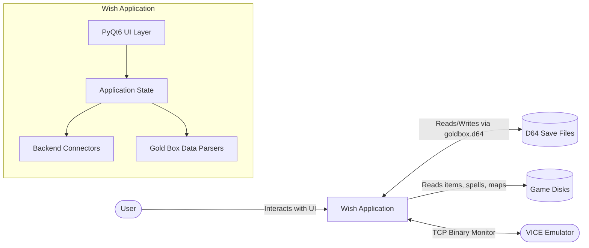
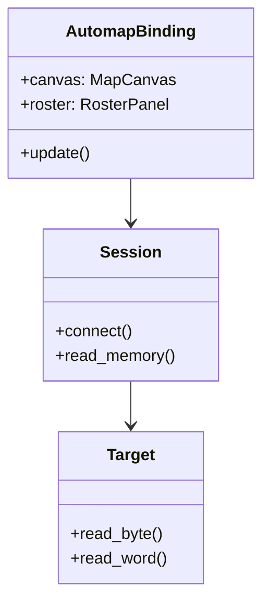
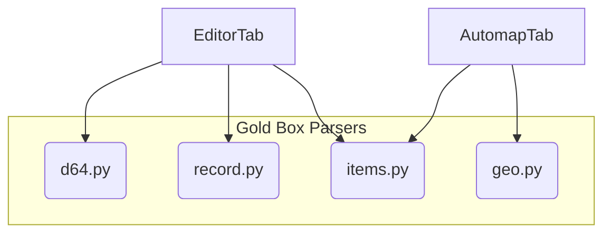

# Wish Architecture

This document describes the high-level architecture of **Wish**, the save editor and live automapper for the Commodore 64 version of *Pool of Radiance* and other Gold Box games.

## High-Level Overview

Wish is a Python application built with PyQt6. It provides two main modes of operation:
1. **Save Editor (Offline):** Edits `.D64` save files to modify character stats, inventory, spells, and icons.
2. **Automapper (Live):** Connects to a running VICE emulator via its binary monitor to read the game's RAM in real-time. It maps the current area, displays party status, and shows combat information.

## Subsystem Breakdown

The application is divided into several primary modules:

### 1. `wish/` (Application Shell)
This is the main entry point and top-level application shell.
* **`__main__.py` & `window.py`:** Parses command-line arguments and constructs the main `WishWindow`.
* **`session.py`:** Manages the connection lifecycle with the VICE emulator.
* **`preferences.py`:** Handles user configuration and settings.

### 2. `automap/` (Live Play Assistant)
The automapper subsystem visualizes the game state by querying the emulator's memory.
* **`window.py`:** (`AutomapBinding`) Manages the automap tab and coordinates the panels.
* **`canvas.py`:** Custom QWidget components that draw the live map and the combat battlefield using QPainter.
* **`state.py` & `maps.py`:** Maintains the current known exploration state, map primitives, and fast travel nodes.

### 3. `editor/` (Save File Editor)
The offline editor components allow users to modify their save files.
* **`window.py`:** (`CharacterEditor` binding) The character sheet and general save editor logic.
* **UI Panels:** Sub-editors for specific features such as `SpellbookEditor`, `PartsPicker` (icons), and `AddItemDialog` (inventory).

### 4. `goldbox/` (Data Models & Parsers)
This is the core logic that knows how to parse and serialize Gold Box data formats.
* **`d64.py`:** Reads and writes Commodore 64 `.D64` disk images.
* **`record.py`:** Parses the 151-byte character record into structured Python classes.
* **`items.py` & `spells.py`:** Parses the item tables and spell data from the game disks.
* **`geo.py`:** Parses the map geometry format (GEO files).

## UI Architecture

Wish uses a unified Qt Designer file (`wish/window.ui`) for the main window layout. The UI separates visual presentation from business logic by defining the structure in XML, which is compiled to Python by `pyuic6`. Python controller classes (`WishWindow`, `AutomapBinding`, `CharacterEditor`) attach to this layout and wire up signals and slots. See `docs/ui-architecture.md` for more details.

## Backend Connection (VICE Binary Monitor)
The automapper relies on VICE's built-in binary monitor to peek into the Commodore 64's RAM while the game is running.
1. The `Session` polls the connection.
2. The `Target` (in `automap/target.py`) sends specific memory read requests over TCP.
3. The responses are decoded to identify the current area, party location, HP, and combat status.
