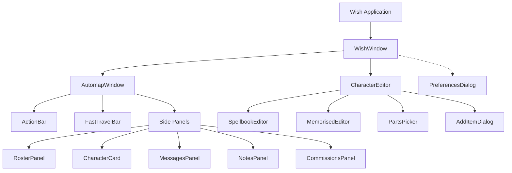

# Wish UI Architecture

This document describes the structure and design patterns of the UI in Wish. The UI is built using PyQt6, and relies heavily on Qt Designer `.ui` files for layout, separating the visual structure from the Python business logic.

## Overview

Wish's user interface is split into three primary domains:

1. **`wish/`**: The top-level application and preferences.
2. **`automap/`**: The live-updating map viewer and play-assist panels.
3. **`editor/`**: The character and save-game editor.



## The Qt Designer Pattern

We use a strict 1:1 mapping between high-level Python widget classes and XML `.ui` files. This keeps layout logic (margins, fonts, spacing, sizing) out of Python, while keeping business logic (signals, slots, model updates) out of the XML.

### 1. File Structure

Each component is broken down into three pieces:
* `component.ui` — The XML definition created in Qt Designer.
* `ui_component.py` — The auto-generated Python code compiled by `tools/genui.py` (via `pyuic6`).
* `component.py` — The hand-coded Python class that wraps the UI.

### 2. Implementation Pattern

The Python wrapper class inherits from the Qt base class (e.g., `QWidget`, `QDialog`) and holds an instance of the generated `Ui_ClassName`. 

```python
from PyQt6.QtWidgets import QWidget
from .ui_mywidget import Ui_MyWidget

class MyWidget(QWidget):
    def __init__(self, parent=None):
        super().__init__(parent)
        
        # 1. Instantiate the auto-generated UI
        self.ui = Ui_MyWidget()
        
        # 2. Attach it to this QWidget
        self.ui.setupUi(self)
        
        # 3. Create convenient aliases (optional)
        self.button = self.ui.submit_button
        
        # 4. Connect signals to Python slots
        self.button.clicked.connect(self._handle_submit)
```

### 3. Dynamic Widgets and Custom Classes

Not everything can be defined statically in Qt Designer.

**Custom Widgets:**
If a `.ui` file needs a custom widget (like `ElidingLabel` or `IconRow`), it is placed in the `.ui` file as a promoted widget using the `<customwidgets>` block. The generated code will automatically import the Python class.

**Dynamic Lists & Buttons:**
For content that changes based on game state (e.g. generating a dynamic row of color picker buttons or appending variable `IconRow` items to a layout), we leave an empty layout placeholder in the `.ui` file (like `<layout class="QVBoxLayout" name="bars_layout">`). The Python code then targets that layout at runtime:

```python
def _add_bar(self, bar_widget):
    self.ui.bars_layout.addWidget(bar_widget)
```

## Component Breakdown

### Core Windows
| Python Class | UI File | Location | Purpose |
|--------------|---------|----------|---------|
| `WishWindow` | `window.ui` | `wish/` | The root QMainWindow holding the tabbed interface. |
| `PreferencesDialog` | `preferences.ui` | `wish/` | The global settings and path configuration modal. |
| `AutomapWindow` | `window.ui` | `automap/` | The main live-map view and container for play-assist panels. |

### Automap Panels
| Python Class | UI File | Location | Purpose |
|--------------|---------|----------|---------|
| `CharacterCard` | `card.ui` | `automap/` | Detailed stats for a single character (HP, AC, etc.). |
| `RosterPanel` | `roster.ui` | `automap/` | The list of all party members. |
| `CommissionsPanel` | `commissions.ui` | `automap/` | Tracks major and minor quests/commissions. |
| `NotesPanel` | `notes.ui` | `automap/` | List of user-created map notes. |
| `NotePopover` | `noteeditor.ui` | `automap/` | Popup modal for editing a map note. |
| `MessagesPanel` | `messages.ui` | `automap/` | Logs the history of game events and dialogue. |
| `ActionBar` | `actionbar.ui` | `automap/` | Quick-action buttons (rest, quickfight). |
| `FastTravelBar`| `fasttravelbar.ui`| `automap/` | The fast-travel combobox and controls. |

### Editor Modals
| Python Class | UI File | Location | Purpose |
|--------------|---------|----------|---------|
| `SpellbookEditor` | `spellbook.ui` | `editor/` | Edits known spells in the spellbook. |
| `MemorisedEditor` | `memorised.ui` | `editor/` | Edits currently memorized spells. |
| `PartsPicker` | `partspicker.ui` | `editor/` | Icon assembly tool (Heads, Weapons). |
| `DosImportDialog` | `dosimport.ui` | `editor/` | Modal for converting DOS saves to C64. |
| `ExportDialog` | `exports.ui` | `editor/` | Modal for exporting character sheets. |
| `AddItemDialog` | `inventory.ui` | `editor/` | Filterable list for adding items to inventory. |

## Updating the UI

To modify the layout of any screen:
1. Open the corresponding `.ui` file in Qt Designer.
2. Make your layout changes (change margins, colors, swap widget types).
3. Save the `.ui` file.
4. Run `env QT_QPA_PLATFORM=offscreen .venv/bin/python tools/genui.py` to regenerate the `ui_*.py` file.
5. Restart Wish.
