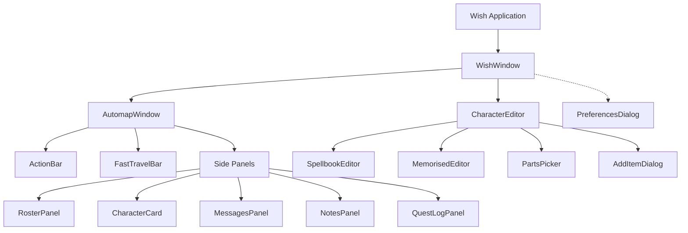

# Wish UI Architecture

This document describes the structure and design patterns of the UI in Wish. The UI is built using PyQt6, and relies heavily on Qt Designer `.ui` files for layout, separating the visual structure from the Python business logic.

## Overview

Wish's user interface is split into three primary domains:

1. **`wish/`**: The top-level application and preferences.
2. **`automap/`**: The live-updating map viewer and play-assist panels.
3. **`editor/`**: The character and save-game editor.



## The Qt Designer Pattern

We use a consolidated UI approach for the main window and its tabs, while keeping standalone dialogs in their own `.ui` files. This keeps layout logic (margins, fonts, spacing, sizing) out of Python, while keeping business logic (signals, slots, model updates) out of the XML.

### 1. File Structure

* `wish/window.ui` — The consolidated XML definition created in Qt Designer that contains the main window, the Automapper tab, the Editor tab, and their panels.
* `ui_window.py` — The auto-generated Python code compiled by `tools/genui.py` (via `pyuic6`).
* Python wrapper classes (like `WishWindow`, `AutomapBinding`, `CharacterEditor`) — Hand-coded Python classes that attach to specific subsets of the UI.

### 2. Implementation Pattern

The main window inherits from the Qt base class and instantiates the generated UI. Sub-components (like panels or tabs) are passed the root window object and find their respective widgets using it.

```python
from PyQt6.QtWidgets import QMainWindow
from .ui_window import Ui_WishWindow

class WishWindow(QMainWindow):
    def __init__(self, parent=None):
        super().__init__(parent)
        
        # 1. Instantiate the auto-generated UI
        self.ui = Ui_WishWindow()
        self.ui.setupUi(self)
        
        # 2. Instantiate sub-components, passing the root window
        self.automap = AutomapBinding(self)
```

Sub-components then attach to their specific parts of the UI:
```python
class AutomapBinding:
    def __init__(self, root):
        self.root = root
        
        # Access widgets directly via the root's UI
        self.roster = RosterPanel(self.root)
        self.strength_label = self.root.findChild(QLabel, "strength_label")
```

### 3. Dynamic Widgets and Custom Classes

Not everything can be defined statically in Qt Designer.

**Custom Widgets:**
If a `.ui` file needs a custom widget (like `ElidingLabel` or `IconRow`), it is placed in the `.ui` file as a promoted widget using the `<customwidgets>` block. The generated code will automatically import the Python class.

**Dynamic Lists & Buttons:**
For content that changes based on game state (e.g. generating a dynamic row of color picker buttons or appending variable `IconRow` items to a layout), we leave an empty layout placeholder in the `.ui` file (like `<layout class="QVBoxLayout" name="bars_layout">`). The Python code then targets that layout at runtime:

```python
def _add_bar(self, bar_widget):
    self.ui.bars_layout.addWidget(bar_widget)
```

## Component Breakdown

### Core Windows
| Python Class | UI File | Location | Purpose |
|--------------|---------|----------|---------|
| `WishWindow` | `wish/window.ui` | `wish/` | The root QMainWindow holding the tabbed interface. |
| `PreferencesDialog` | `wish/preferences.ui` | `wish/` | The global settings and path configuration modal. |
| `AutomapBinding` | `wish/window.ui` | `automap/` | The main live-map view and container for play-assist panels. |
| `CharacterEditor` | `wish/window.ui` | `editor/` | The character editor tab. |

### Automap Panels (Consolidated in wish/window.ui)
| Python Class | Location | Purpose |
|--------------|----------|---------|
| `CharacterCard` | `automap/` | Detailed stats for a single character (HP, AC, etc.). |
| `RosterPanel` | `automap/` | The list of all party members. |
| `QuestLogPanel` | `automap/` | The Quest Log: the City Council's commissions and summonses, read-only. |
| `NotesPanel` | `automap/` | List of user-created map notes. |
| `MessagesPanel` | `automap/` | Logs the history of game events and dialogue. |
| `ActionBar` | `automap/` | Quick-action buttons (rest, quickfight). |
| `FastTravelBar`| `automap/` | The fast-travel combobox and controls. |

*Note: `NotePopover` remains in `automap/noteeditor.ui` since it is a popup.*

### Editor Modals (Standalone .ui files)
| Python Class | UI File | Location | Purpose |
|--------------|---------|----------|---------|
| `SpellbookEditor` | `editor/spellbook.ui` | `editor/` | Edits known spells in the spellbook. |
| `MemorisedEditor` | `editor/memorised.ui` | `editor/` | Edits currently memorized spells. |
| `PartsPicker` | `editor/partspicker.ui` | `editor/` | Icon assembly tool (Heads, Weapons). |
| `DosImportDialog` | `editor/dosimport.ui` | `editor/` | Modal for converting DOS saves to C64. |
| `ExportDialog` | `editor/exports.ui` | `editor/` | Modal for exporting character sheets. |
| `AddItemDialog` | `editor/inventory.ui` | `editor/` | Filterable list for adding items to inventory. |

## Updating the UI

To modify the layout of any screen:
1. Open the corresponding `.ui` file in Qt Designer.
2. Make your layout changes (change margins, colors, swap widget types).
3. Save the `.ui` file.
4. Run `env QT_QPA_PLATFORM=offscreen .venv/bin/python tools/genui.py` to regenerate the `ui_*.py` file.
5. Restart Wish.
