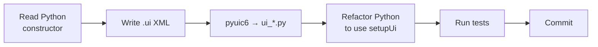

# Extract UI to .ui files — Staged Implementation Plan

## Goal

Move every widget layout that a human might rearrange from Python code into Qt Designer `.ui` files. After this work, Donald can open any part of the UI in Qt Designer and rearrange it visually.

## Design Decision: One .ui per class

Each Python class that builds a widget layout gets its own `.ui` file. The `.ui` file's top-level widget maps 1:1 to the class.

**Why not one master .ui for the whole window?** A `.ui` declares one top-level widget. Sub-panels like `RosterPanel`, `NotesPanel`, etc. are separate Python classes with their own methods, signals, and lifecycle. Inlining them into the parent's `.ui` would require merging those classes into `AutomapWindow` — an architectural rewrite, not a layout extraction. Keeping one `.ui` per class means the layout moves to Designer without touching the Python architecture.

**How they connect:** `automap/window.ui` declares placeholder `QWidget`s where sub-panels go. In Designer you see the grid layout with labelled boxes. Each sub-panel's own `.ui` describes what's inside that box. Promoted widgets link them together.

---

## Current State

The previous session completed these items. Full test suite confirms: **2286 passed, 38 skipped, 0 failures.**

| Done | Component | Files |
|---|---|---|
| ✅ | **Infrastructure** | [genui.py](file:///home/donald/src/wish/tools/genui.py) generalized, [test.yml](file:///home/donald/src/wish/.github/workflows/test.yml) updated, [designer](file:///home/donald/src/wish/designer) updated |
| ✅ | **CLAUDE.md rule** | [CLAUDE.md](file:///home/donald/src/wish/CLAUDE.md) — new "Qt Designer" section |
| ✅ | **WishWindow** | [wish/window.ui](file:///home/donald/src/wish/wish/window.ui) + [wish/window.py](file:///home/donald/src/wish/wish/window.py) refactored |
| ✅ | **AutomapWindow** | [automap/window.ui](file:///home/donald/src/wish/automap/window.ui) + [automap/window.py](file:///home/donald/src/wish/automap/window.py) refactored |
| ✅ | **PreferencesDialog** | [wish/preferences.ui](file:///home/donald/src/wish/wish/preferences.ui) + [wish/preferences.py](file:///home/donald/src/wish/wish/preferences.py) refactored |

**Nothing committed yet.** All changes are unstaged.

---

## What does NOT need a .ui file

These have zero layout construction — they are models, custom-paint widgets, or convenience wrappers:

| File | Class | Why |
|---|---|---|
| [wish/about.py](file:///home/donald/src/wish/wish/about.py) | `box()` | Uses `QMessageBox` — no custom layout |
| [editor/effects.py](file:///home/donald/src/wish/editor/effects.py) | `EffectsView` | Pure `QTableView` subclass |
| [editor/rosterview.py](file:///home/donald/src/wish/editor/rosterview.py) | `RosterView` | Pure `QTableView` subclass |
| [editor/iconwidget.py](file:///home/donald/src/wish/editor/iconwidget.py) | `IconEditor` | Custom `QPainter` — no layout |
| [automap/combatlog.py](file:///home/donald/src/wish/automap/combatlog.py) | `CombatLog` | Pure data processing, no Qt widgets |

---

## Remaining Stages

Each stage is one component touching only its own files. Ordered easiest → hardest.

---

### Stage 0 — Commit existing work
**Work:** Run full test suite (already confirmed green), commit all 5 completed pieces.
**Output:** One clean commit on `main`.
**Test:** `env QT_QPA_PLATFORM=offscreen .venv/bin/python -m pytest tests/ -x -q`

---

### Stage 1 — AddItemDialog
**Difficulty:** ★☆☆☆☆ — 3 layout calls
**File:** [editor/inventory.py](file:///home/donald/src/wish/editor/inventory.py) `AddItemDialog` (line 346)
**Layout:** QDialog → QVBoxLayout → QLineEdit `search` + QListWidget `list` + QDialogButtonBox

#### [NEW] editor/inventory.ui
#### [NEW] editor/ui_inventory.py
#### [MODIFY] editor/inventory.py
**Test:** `tests/test_editor.py`

---

### Stage 2 — DosImportDialog
**Difficulty:** ★★☆☆☆ — 9 layout calls
**File:** [editor/dosimport.py](file:///home/donald/src/wish/editor/dosimport.py) `DosImportDialog` (line 227)
**Layout:** QDialog → QVBoxLayout → QFormLayout (fields) + QDialogButtonBox

#### [NEW] editor/dosimport.ui
#### [NEW] editor/ui_dosimport.py
#### [MODIFY] editor/dosimport.py
**Test:** `tests/test_dosimport.py tests/test_editor.py`

---

### Stage 3 — ExportDialog
**Difficulty:** ★★☆☆☆ — 11 layout calls
**File:** [editor/exports.py](file:///home/donald/src/wish/editor/exports.py) `ExportDialog` (line 393)
**Layout:** QDialog → QVBoxLayout → QFormLayout + QTextEdit `report_pane` + QDialogButtonBox
**Note:** `DosExportDialog` and `AmigaExportDialog` subclass it — they call `_add_fields` to extend the form.

#### [NEW] editor/exports.ui
#### [NEW] editor/ui_exports.py
#### [MODIFY] editor/exports.py
**Test:** `tests/test_exports.py tests/test_editor.py`

---

### Stage 4 — SpellbookEditor + MemorisedEditor
**Difficulty:** ★★☆☆☆ — 10 layout calls across 2 classes
**File:** [editor/spellwidget.py](file:///home/donald/src/wish/editor/spellwidget.py)
**Layout:**
- `SpellEditor` (line 139): QVBoxLayout → QLabel + QListWidget
- `MemorisedEditor` inherits and adds: choice combo + button row + capacity label
**Note:** Two promoted widget classes → two separate `.ui` files per Donald's decision.

#### [NEW] editor/spellbook.ui
#### [NEW] editor/memorised.ui
#### [NEW] editor/ui_spellbook.py
#### [NEW] editor/ui_memorised.py
#### [MODIFY] editor/spellwidget.py
**Test:** `tests/test_editor.py`

---

### Stage 5 — NotePopover
**Difficulty:** ★★☆☆☆ — 12 layout calls
**File:** [automap/noteeditor.py](file:///home/donald/src/wish/automap/noteeditor.py) `NotePopover` (line 44)
**Layout:** QWidget → QVBoxLayout → heading + colour-picker row + QPlainTextEdit + button row + hint
**Note:** Colour-picker buttons are built from a list of 6 colours — use QHBoxLayout placeholder in .ui, buttons added in Python.

#### [NEW] automap/noteeditor.ui
#### [NEW] automap/ui_noteeditor.py
#### [MODIFY] automap/noteeditor.py
**Test:** `tests/test_automap.py`

---

### Stage 6 — PartsPicker
**Difficulty:** ★★☆☆☆ — 14 layout calls
**File:** [editor/partspicker.py](file:///home/donald/src/wish/editor/partspicker.py) `PartsPicker` (line 75)
**Layout:** QDialog → QVBoxLayout → size row + preview + 3 list columns + QDialogButtonBox

#### [NEW] editor/partspicker.ui
#### [NEW] editor/ui_partspicker.py
#### [MODIFY] editor/partspicker.py
**Test:** `tests/test_editor.py tests/test_icons.py`

---

### Stage 7 — ActionBar + FastTravelBar
**Difficulty:** ★★★☆☆ — 10 layout calls across 2 classes
**File:** [automap/actionbar.py](file:///home/donald/src/wish/automap/actionbar.py)
**Layout:**
- `ActionBar` (line 88): QGridLayout with dynamic buttons, watch checkbox, note label
- `FastTravelBar` (line 270): QGridLayout with combo, fasttravel/back buttons, note label
**Note:** ActionBar buttons are built from a runtime action list — .ui declares grid + static widgets, buttons added in Python.

#### [NEW] automap/actionbar.ui
#### [NEW] automap/fasttravelbar.ui
#### [NEW] automap/ui_actionbar.py
#### [NEW] automap/ui_fasttravelbar.py
#### [MODIFY] automap/actionbar.py
**Test:** `tests/test_automap.py tests/test_fasttravel.py`

---

### Stage 8 — QuestLogPanel
**Difficulty:** ★★★☆☆ — 16 layout calls, nested scroll area with dynamic groups
**File:** [automap/questlog.py](file:///home/donald/src/wish/automap/questlog.py) `QuestLogPanel` (line 359)
**Layout:** QWidget → QVBoxLayout → heading + QScrollArea (inner VBox with dynamic Row/Group widgets)
**Note:** `Row` and `Group` are dynamically created — they stay as Python.

#### [NEW] automap/questlog.ui
#### [NEW] automap/ui_questlog.py
#### [MODIFY] automap/questlog.py
**Test:** `tests/test_automap.py tests/test_commissions.py`

---

### Stage 9 — automap/panel.py (5 classes)
**Difficulty:** ★★★★☆ — 29 layout calls across 5 classes, the largest remaining file
**File:** [automap/panel.py](file:///home/donald/src/wish/automap/panel.py)

| Class | Line | Layout | .ui file |
|---|---|---|---|
| `CharacterCard` | 342 | VBox: name row, class row, HP bar, XP bars, readied, effects, buttons | `automap/card.ui` |
| `RosterPanel` | 529 | VBox: heading + scroll area holding cards | `automap/roster.ui` |
| `BottomStrip` | 607 | HBox: area, coords, facing, effects, step counter labels | `automap/bottomstrip.ui` |
| `NotesPanel` | 684 | VBox: heading + list widget | `automap/notes.ui` |
| `MessagesPanel` | 751 | VBox: heading + list widget | `automap/messages.ui` |

**Note:** `CharacterCard` is dynamically created per roster slot but gets its own `.ui` per Donald's decision. `Bar` (line 128) and `IconRow` (line 91) are custom-painted — they stay as promoted widgets.

#### [NEW] automap/card.ui, roster.ui, bottomstrip.ui, notes.ui, messages.ui
#### [NEW] automap/ui_card.py, ui_roster.py, ui_bottomstrip.py, ui_notes.py, ui_messages.py
#### [MODIFY] automap/panel.py
**Test:** `tests/test_automap.py tests/test_windowslayout.py`

---

## Each stage follows the same recipe



---

## Verification Plan

### After each stage
```bash
env QT_QPA_PLATFORM=offscreen .venv/bin/python -m pytest <stage-specific tests> -x -q
```

### After all stages
```bash
# All .ui files compile and match
env QT_QPA_PLATFORM=offscreen .venv/bin/python tools/genui.py --check

# Full suite
env QT_QPA_PLATFORM=offscreen .venv/bin/python -m pytest tests/ -x -q
```

### Manual (Donald)
Open every `.ui` file in Qt Designer and confirm it loads and shows the expected layout:
```bash
/usr/lib/qt6/bin/designer editor/character.ui wish/window.ui automap/window.ui wish/preferences.ui
```
